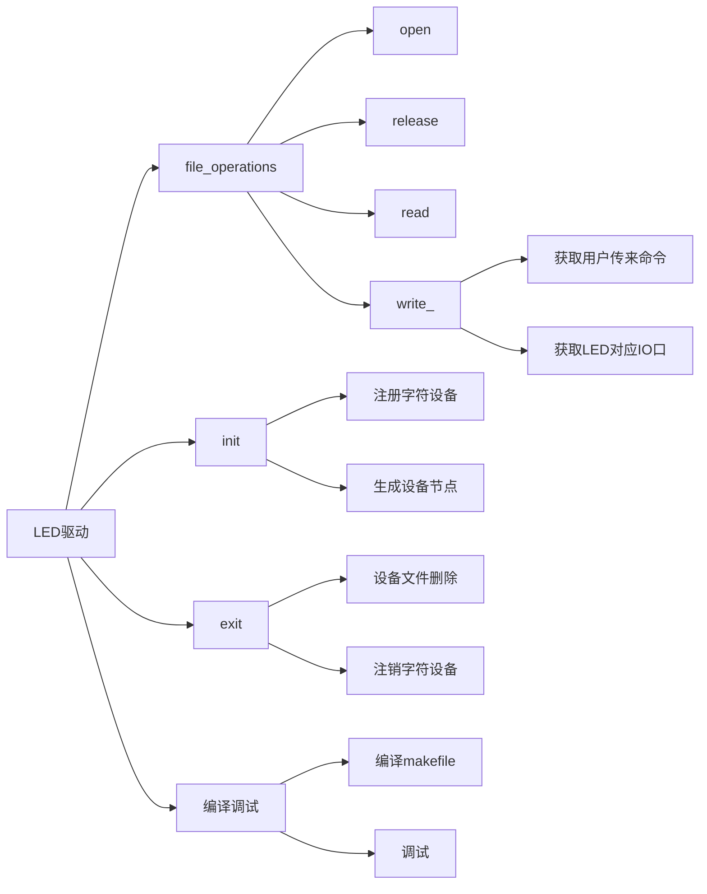

## Linux字符设备驱动设计

### 概述  

#### 驱动的定义与功能  


计算机系统中存在着大量的设备， 操作系统要求能够控制和管理这些硬件， 而驱动就是帮助操作系统完成这个任务。  

驱动相当于硬件的接口， 它直接操作、 控制着我们的硬件， 操作系统通过驱动这个接口才能管理硬件。  


#### 驱动程序与应用程序

驱动程序本身也是代码， 但与应用程序不同， 它不会主动去运行， 而是被调用。 这调用者就是应用程序。  

驱动与应用是服务与被服务的关系。 驱动是为应用服务的。因为应用程序很多时候需要用到硬件设备， 但不能直接操作硬件设备， 所以通过系统调用陷入内核调用驱动， 从而操作硬件。  

应用与驱动程序在系统中所处位置不同,决定了它们代码运行模式也不一样。  

应用程序运行在用户空间(用户态)  

驱动代码运行于内核空间(内核态)。  


应用要"过五关斩六将" 才能使用硬件设备。  

系统调用： 内核提供给用户程序的一组“ 特殊” 函数接口，用户程序可以通过这组接口获得内核提供的服务  


#### 驱动/库/内核/应用  


应用程序调用函数库完成一系列功能， 一部分库函数通过系统调用由内核完成相应功能， 例如： printf、 fread函数等等。  

内核处理系统调用， 内核在实现系统调用时会根据需要调用设备驱动程序操作硬件。  

设备驱动是硬件设备的直接控制者， 它完成了内核和硬件的通信任务  

库属于用户态， 驱动属于内核态， 所以驱动无法使用标准C库里面的函数。  

```c
printf();
sprintf();
strlen();
```

内核实现了大部分常用的函数， 供驱动使用。 有些函数名尽管相同， 实现方式是不一样的。  

```c
printk();
sprintf();
strlen();
```


### linux驱动相关概念

在linux世界里面， 驱动可分为三大类：

*   字符设备
*   块设备
*   网络设备  

字符设备  

*   I/O传输过程中以字符为单位进行传输。  
*   用户对字符设备发出读/写请求时， 实际的硬件读/写操作一般紧接着发生。  

块设备  

*   块设备与字符相反， 它的数据传输以块（ 内存缓冲） 为单位传输。  
*   用户对块设备读/写时， 硬件上的读/写操作不会紧接着发生,即用户请求和硬件操作是异步的  
*   磁盘类、 闪存类等设备都封装成块设备。  

网络设备  

网络设备是一类特殊的设备， 它不像字符设备或块设备那样通过对应的设备文件访问， 也不能直接通过read或write
进行数据请求， 而是通过socket接口函数进行访问。  


设备文件和主/从设备号  

linux把设备抽象成文件,“一切设备皆文件” 。 所以对硬件的操作全部抽象成对文件的操作。  

驱动是硬件的最直接操作者， 设备文件是用户程序与设备驱动的一个接口,应用程序通过操作设备文件来调用设备驱动程序。  


设备文件存放于/dev目录下， 可以用ls -l或ll查看  

每个设备文件都有其文件属性， 属性包括：  

*   设备类型（首字母 c=字符设备 b=块设备)  
*   主/从设备号  


应用程序通过设备文件找到设备驱动  

主设备号： 用于标识驱动程序,主设备号一样的设备文件将使用同一类驱动程序。 (1-254)  

从设备号： 用于标识使用同一驱动程序的不同具体硬件。(0-255)  

例如： 210开发板中的串口设备， 主设备号标识串口这类设备， 从设备号标识具体的某个串口。  

```shell
# 查看当前系统中主设备号的使用情况和其对应的硬件设备
cat /proc/devices
```


### linux模块编程  

Linux内核抛弃把所有功能模块都编译到内核的做法， 采用了模块化的方法将各组件灵活添加和删减， 并且驱动模块还可以动态加载、 删除。  

使用模块的好处：  

*   内核体积小： 不需要的组件可以不编入内核  
*   开发灵活： 模块可以同普通软件一样， 从内核中添加或删除  
*   平台无关、 节省内存  

```c
#include <linux/module.h>
#include <linux/kernel.h>
#include <linux/init.h>

/*模块加载函数*/
int __init xxx_module_init (void) 
{ 
    //... 
}

/*模块卸载函数*/
void __exit xxx_module_exit (void) 
{ 
    //... 
}
/*声明模块加载函数宏*/
module_init(xxx_module_init);

/*声明模块卸载函数宏*/
module_exit(xxx_module_exit);

/*声明模块作者*/
MODULE_AUTHOR(“sunplusedu” );

/*模块许可证明， 描述内核模块的许可权限*/
MODULE_LICENSE("GPL");
```

模块加载函数  

*   完成相关资源申请、 硬件初始化以及驱动的注册  
*   若初始化成功返回0, 失败返回错误值  
*   模块加载函数必须以" module_init(函数名) "形式进行声明  

模块卸载函数：  

*   释放已申请资源、 注销驱动  
*   在模块卸载时被执行， 不返回任何值  
*   函数需要以" module_exit(函数名) "的形式进行声明  


Linux内核模块的编译方法有两种：  

*   放入Linux内核源码中编译
*   采用独立的方法编译模块  


放入Linux内核源码中编译  

*   将写好的模块放入Linux内核任一目录下
*   修改相应目录下的Kconfig和Makefile文件
*   执行make modules
*   会在相同目录下生成与源文件同名的.ko文件  

采用独立的方法编译模块  

linux内核还提供了一种方法可以独立编译模块， 我们可以在自定义的目录下编译驱动程序， 其makefile内容如下：  

```makefile
#this is a makefile
ifeq ($(KERNELRELEASE),3.4.39)
obj-m := module_test.o #模块名字，与C文件同名
else
KERNELDIR = /…/kernel-3.4.39 #内核路径
PWD = $(shell pwd) #当前路径
default: #编译过程
	$(MAKE) -C $(KERNELDIR) M=$(PWD) modules
clean:
	rm -rf *.ko
endif
```


Linux内核模块的使用：  

```shell
lsmod 			# 列举当前系统中的所有模块
insmod xxx.ko 	# 加载指定模块到内核
rmmod xxx 		# 卸载指定模块(不需要.ko后缀)
```

注意事项：  

若卸载时出现以下提示：

>   rmmod:chdir(3.4.39-sunplusedu): No such file or directory  

在开发板根文件系统下建立以下目录：

>   /lib/modules/3.4.39-sunplusedu（跟当前内核版本同名)  


### 字符驱动程序框架  

模块是linux内核进行组件管理的一种方式， 驱动是基于模块进行注册和注销的。  

不单单是字符设备， 块设备驱动和网络设备驱动都是基于模块进行加载和删除的。  

字符设备是最基本、 最常用的设备。 它将千差万别的各种硬件设备采用一个统一的接口封装起来， 屏蔽硬件差异， 简化了应用层的操作。  

如： 按键 , LED灯 , 触摸屏 ,  温湿度传感器  


应用程序的open、 read、 write函数最终会调到驱动里面的open、 read、 write函数  

与系统调用函数类似， 驱动的这几个函数参数都是固定不变的， 但函数名可以自己编写  

这几个函数是由我们在驱动代码上去实现的， 也就是说， read/write函数要对硬件进行怎样的操作是驱动决定的  


file_operations结构体  

*   驱动的open/read/write函数实际上是由一个叫 file_operations的结构体统一管理的。  
*   这是字符驱动最重要的一个结构体(之一)， 里面包含了一组函数指针。 这组函数指针指向驱动open/read/write等几个函数。  
*   一个打开的设备文件就和该结构体关联起来， 结构体中的函数实现了对文件的系统调用， 这样file_operations中的函数就 和open/read/write等系统调用函数一一对应  

```c
//  include/linux/fs.h
struct file_operations {
	struct module *owner;
	loff_t (*llseek) (struct file *, loff_t, int);
	ssize_t (*read) (struct file *, char __user *, size_t, loff_t *);
	ssize_t (*write) (struct file *, const char __user *, size_t, loff_t *);
	ssize_t (*read_iter) (struct kiocb *, struct iov_iter *);
	ssize_t (*write_iter) (struct kiocb *, struct iov_iter *);
	int (*iopoll)(struct kiocb *kiocb, bool spin);
	int (*iterate) (struct file *, struct dir_context *);
	int (*iterate_shared) (struct file *, struct dir_context *);
	__poll_t (*poll) (struct file *, struct poll_table_struct *);
	long (*unlocked_ioctl) (struct file *, unsigned int, unsigned long);
	long (*compat_ioctl) (struct file *, unsigned int, unsigned long);
	int (*mmap) (struct file *, struct vm_area_struct *);
	unsigned long mmap_supported_flags;
	int (*open) (struct inode *, struct file *);
	int (*flush) (struct file *, fl_owner_t id);
	int (*release) (struct inode *, struct file *);
	int (*fsync) (struct file *, loff_t, loff_t, int datasync);
	int (*fasync) (int, struct file *, int);
	int (*lock) (struct file *, int, struct file_lock *);
	ssize_t (*sendpage) (struct file *, struct page *, int, size_t, loff_t *, int);
	unsigned long (*get_unmapped_area)(struct file *, unsigned long, unsigned long, unsigned long, unsigned long);
	int (*check_flags)(int);
	int (*flock) (struct file *, int, struct file_lock *);
	ssize_t (*splice_write)(struct pipe_inode_info *, struct file *, loff_t *, size_t, unsigned int);
	ssize_t (*splice_read)(struct file *, loff_t *, struct pipe_inode_info *, size_t, unsigned int);
	int (*setlease)(struct file *, long, struct file_lock **, void **);
	long (*fallocate)(struct file *file, int mode, loff_t offset,
			  loff_t len);
	void (*show_fdinfo)(struct seq_file *m, struct file *f);
#ifndef CONFIG_MMU
	unsigned (*mmap_capabilities)(struct file *);
#endif
	ssize_t (*copy_file_range)(struct file *, loff_t, struct file *,
			loff_t, size_t, unsigned int);
	loff_t (*remap_file_range)(struct file *file_in, loff_t pos_in,
				   struct file *file_out, loff_t pos_out,
				   loff_t len, unsigned int remap_flags);
	int (*fadvise)(struct file *, loff_t, loff_t, int);
} __randomize_layout;
```

file_operations  常用函数

```c
struct file_operations {
	struct module *owner;
    ssize_t (*read) (struct file *, char __user *, size_t, loff_t *);
	ssize_t (*write) (struct file *, const char __user *, size_t, loff_t *);
    int (*open) (struct inode *, struct file *);
    int (*release) (struct inode *, struct file *);
}
```


当执行insmod命令插入一个设备驱动时， 相应的模块初始化函数被执行：  

在初始化函数中根据需要申请资源和初始化。  

*   中断、 内存等资源申请  
*   IO口等硬件初始化  

利用register_chrdev()把驱动注册进内核  

条件： 

*   主设备号
*   设备名字
*   填充好的file_operations结构体  


字符设备注册函数  

```c
/**
 * @function: 字符设备注册
 * @parameter: 
 *		major: 主设备号， 一般填0， 由内核自动分配
 *		name: 设备驱动名， 注册成功可以使用 , cat /proc/device 查看
 *		fops: 填充好的file_operations 结构体变量地址
 * @return: 
 *     success: 分配好的主设备号
 *     error: 
 * @note: 
 */
int register_chrdev(unsigned int major, const char *name, const struct file_operations *fops);
```

字符设备注销函数  

```c
/**
 * @function: 字符设备注销
 * @parameter: 
 *		major: 主设备号
 *		name: 设备驱动名
 * @return: 
 *     success: 
 *     error: 
 * @note: 
 */
void unregister_chrdev(unsigned int major, const char name)
```

字符设备驱动编译成功生成.ko文件后， 使用字符驱动  

加载驱动程序  

*   insmod 内核模块文件名.ko  
*   cat /proc/devices 查看当前系统中所有设备驱动程序及其主设备号  

手动建立设备文件  

*   设备文件一般建立/dev目录下， 可通过命令创建  
*   mknod /dev/文件名 c 主设备号 从设备号  

采用mknod命令的方式创建设备文件有些繁琐， 就此linux为我们提供了一种udev机制实现设备文件的自动创建（只需在模块初始化函数中添加几行代码） 。  

该方式的思想是使用insmod 插入模块时自动创建设备节点， 使用rmmod 卸载模块时删除设备节点  

udev是linux2.6内核引入的设备管理器， 主要负责管理 /dev下设备节点  


自动创建功能的实现分两步完成  

首先定义和创建设备类：  

```c
struct class *my_class;
//name: 设备类名
my_class = class_create(THIS_MODULE, name);
```

根据类创建设备节点：  

```c
struct device *my_device;
//MKDEV : 主/次设备号组成一个设备号
//name: 设备节点名
my_device = device_create(my_class, NULL, MKDEV(major_nr, minor_nr), NULL, name);
```


卸载过程也分为两步完成  

首先删除设备节点：  

```c
device_destroy(my_class, MKDEV(major_nr, minor_nr));
```

销毁创建好的设备类：  

```c
class_destroy(my_class);
```


inode结构体  

inode结构体记录了文件系统中文件的相关信息， 比如 文件大小、 创建者、 创建日期等等， 我们也称之为“索引节点” ， 每个文件都有与之对应的inode， 也就是说 inode表示具体的文件。  


file结构体  

file结构体是一个内核结构， 它不会出现在用户程序中， 它跟用户空间FILE不是一回事  

file结构体代表一个打开的文件（文件描述符） ，在open时它由内核自动创建， 并传递给file_operations所指向的各个函数， 当文件关闭后该结构体被释放。  

该结构体记录了文件的读写模式、 文件当前读写位置、 还有file_operations结构体的指针等  


inode结构体中包含了设备文件的主从设备号，用户可通过以下宏获取：  

```c
unsigned int iminor(struct inode *inode);
unsigned int imajor(struct inode *inode);
```

用户态与内核态数据的传输  

应用程序与驱动程序分属于不同的地址空间， 二者之间的数据应当采用以下函数进行交换  

```c
//从内核空间拷贝n字节数据到用户空间
//user_buffer: 标首地址
//kernel_buffer: 源数据首地址
copy_to_user(user_buffer, kernel_buffer, n)
```

```c
//从用户空间拷贝n字节数据到内核空间
copy_from_user(kernel_buffer, user_buffer, n)
```

```c
//从内核空间拷贝一数据（ 任意类型） 变量到用户空间
put_user(kernel_value, user_buffer)
```

```c
//从用户空间拷贝一数据（ 任意类型） 变量到内核空间
get_user(kernel_value, user_buffer)
```

```c
//buf :用户传过来的数据
//count: 数据的大小
ssize_t demo_write(struct file *filp, const char *buf, size_t count, loff_t *f_pos)
{
    unsigned char aver[100] = {0};
    
    if(copy_to/from_user(aver, buf, count) != 0)
    {
        return -EFAULT;
    }
    
    return count;
}
```


### GPIO程序设计  

S5P6818 GPIO寄存器  

|       GPIOxOUT        |      GPIOxOUTENB      |       GPIOxPAD        |          GPIOxALTFNn          |
| :-------------------: | :-------------------: | :-------------------: | :---------------------------: |
|       输出高/低       |     引脚输入/输出     |    读输入高/低电平    | 引脚功能(gpio或其 他固定功能) |
| 每1位配置1个 gpio引脚 | 每1位配置1个 gpio引脚 | 每1位读取1个 gpio引脚 |     每2位配置1个 gpio引脚     |

键盘工作原理  

3*3键盘可采用轮训方式检测， 配置GPIOA_28、GPIOC_11和GPIOC_12为输入且上拉使能， 然后就是while循环读取输入引脚  


配置IO口相关寄存器的两种实现方法：  

直接操作gpio相关寄存器  

*   和裸机程序gpio配置方式类似， 通过移位操作读写寄存器的值  

使用内核的io操作接口函数  

*   linux内核为方便用户对io口的配置提供了一系列的接口函数，而且我们建议使用该方式， 可以提高代码可移植性  


```c
//操作gpio相关寄存器（地址映射）
//头文件
#include <asm/io.h>
#include <linux/ioport.h>

unsigned int reg;

//寄存器虚拟首地址（地址映射）
//映射后的寄存器地址排列顺序和间隔同映射前一致， 因此虚拟首地址+ 偏移量即可得到具体寄存器地址
gpioa_base = ioremap(0xC001A000, 0x64);

//读GPIOAOUTENB寄存器
reg = readl(gpioa_base + 4);

//写GPIOAOUTENB寄存器
writel(reg, gpioa_base + 4);

```


```c
//linux内核提供了一组函数来操作IO口寄存器， 驱动程序员可直接使用
#include <plat/gpio-cfg.h>
#include <mach/gpio.h>

//LED硬件连接
//GPIO 引脚A30/B00/B10/A8 分别连接 led 1/2/3/4

//LED的IO初始化
//GPIOxALTFNn： 配置为GPIO功能
//GPIOxOUTENB： 配置为输出功能


//点亮LED
//GPIOxOUT： 输出高电平


```





ioctl驱动接口实现  

通过设备驱动程序执行各种类型的硬件控制， 而ioctl可以对此支持  

ioctl中的cmd与arg参数都是由程序员自行规定的，具有很高的灵活性  

```c
int (*unlocked_ioctl)(struct file *,unsigned int, unsigned long);
```


