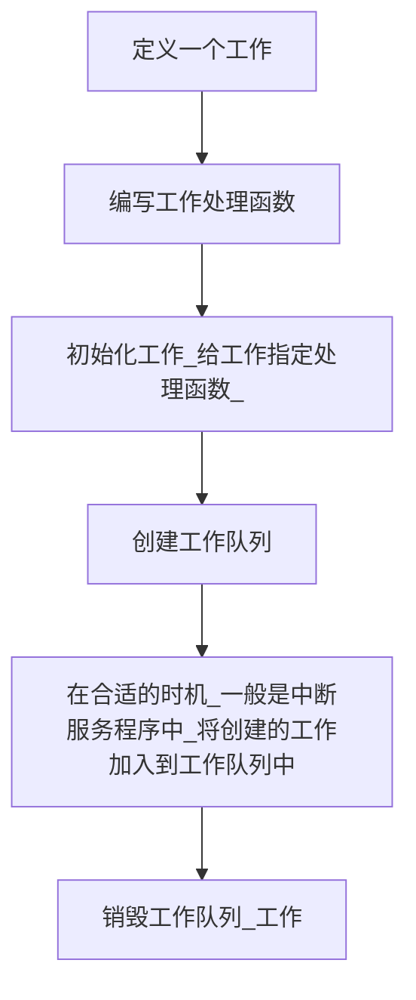
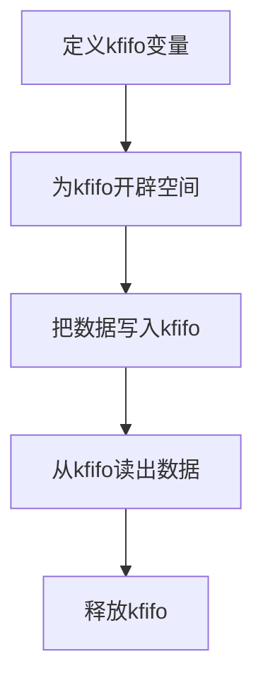
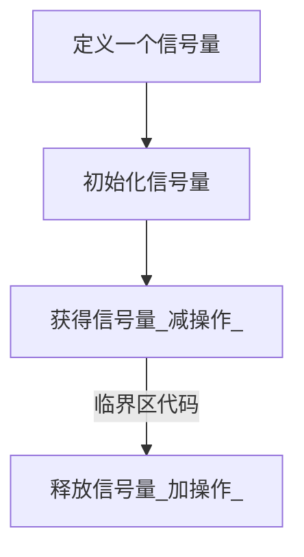
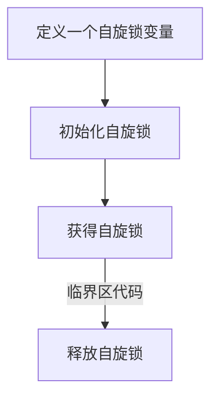
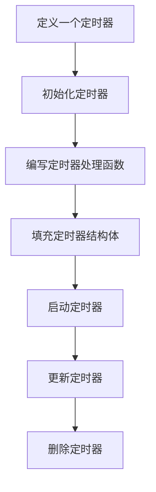
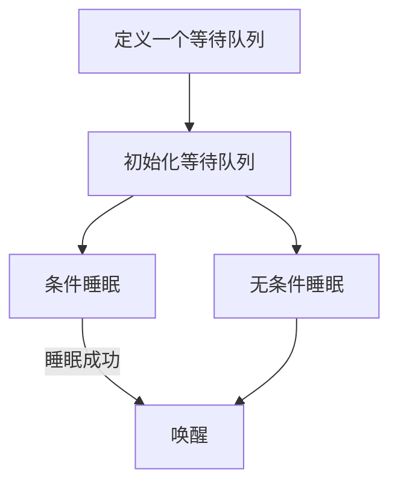
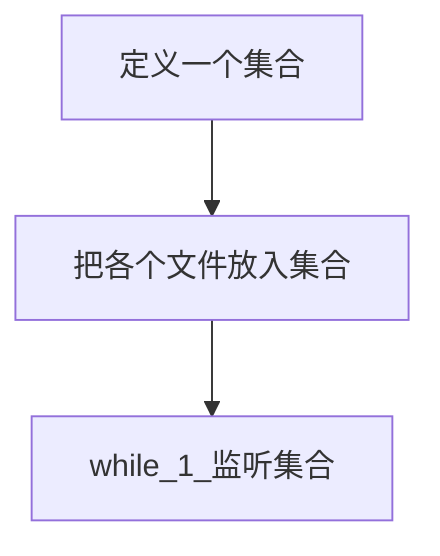
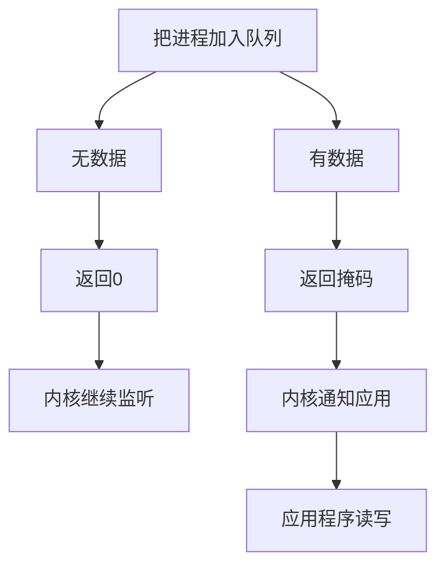
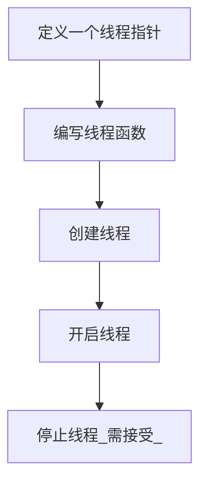

<!--
 * @Author: cpu_code
 * @Date: 2020-06-30 16:15:35
 * @LastEditTime: 2020-07-01 18:00:03
 * @FilePath: \md\Linux\6818_Linux驱动.md
 * @Gitee: https://gitee.com/cpu_code
 * @CSDN: https://blog.csdn.net/qq_44226094
--> 
 * @Author: cpu_code
 * @Date: 2020-06-30 16:15:35
 * @LastEditTime: 2020-07-01 17:59:23
 * @FilePath: \md\Linux\6818_Linux驱动.md
 * @Gitee: https://gitee.com/cpu_code
 * @CSDN: https://blog.csdn.net/qq_44226094


## Linux设备驱动核心概念

### Linux内核中断处理

Linux操作系统下同裸机程序一样,需要利用中断机制来处理硬件的异步事件。 而用户态是不允许中断事件的， 因此中断必须由驱动程序来接收与处理  

如果CPU接收到一个中断， 它会停止一切工作，调用中断处理函数， 因为进程调度依赖中断， 此时进程调度也会停止， 所以就要求我们的中断处理一定要快  

中断处理程序运行在中断上下文中  

上下文： 内核运行环境， 包括寄存器值、 堆栈等数据。

进程上下文： 一个进程在内核态执行时,CPU的所有寄存器中的值、 进程的状态以及堆栈中的内容等。

中断上下文： 中断服务程序执行时所处的内核环境,CPU的所有寄存器的值、 中断相关的硬件参数（ 中断控制器的寄存器中的值） 、 被打断进程的信息等。  

中断上下文注意事项：  

*   不能使用导致睡眠的处理机制（ 信号量、 等待队列等）
*   不能与用户空间交互数据(copy_to/from_user)
*   中断处理函数执行时间尽可能短  

中断相关函数介绍：  

```c
#include <linux/interrupt.h> //头文件

/**
 * @function: 申请中断
 * @parameter: 
 *		irq : 中断号， 所申请的中断向量， 比如EXIT0中断等定义在mach/irqs.h
 *		handler: 中断服务程序（ 函数指针）
 *		irqflag: 中断属性设置， 定义在linux/interrupt.h
 *			IRQF_DISABLED: 用于保证中断不被打断和嵌套
 *			IRQF_SHARED: 申请子中断时， 共享中断源
 *			IRQF_SAMPLE_RANDOM: 表示对系统熵有贡献， 对系统获取随机数有好处
 *		devname: 中断名字， cat /proc/interrupts 可察看系统中断信息
 *		dev_id: 私有数据。 给中断服务函数传递的数据。
 * @return: 
 *     success: 
 *     error: 
 * @note: 
 */
int request_irq(unsigned int irq, 
                rqreturn_t(*handler)(int, void*), 
                unsigned long irqflag, 
                const char *devname,
                void *dev_id);

/**
 * @function: 设置中断触发方式（ 外部中断）
 * @parameter: 
 *		irq : 中断号
 *		edge: 外部中断触发方式定义在linux/irq.h
 *			IRQ_TYPE_LEVEL_LOW,
 *			IRQ_TYPE_LEVEL_HIGH,
 *			IRQ_TYPE_EDGE_FALLING,
 *			IRQ_TYPE_EDGE_RISING,
 *			IRQ_TYPE_EDGE_BOTH
 * @return: 
 *     success: 
 *     error: 
 * @note: 
 */
int set_irq_type(int irq, int edge);
 
/**
 * @function: 释放中断
 * @parameter: 
 *		irq : 所要清除中断服务程序的中断号
 *		dev_id: 中断参数， 同申请时的值一致
 * @return: 
 *     success: 
 *     error: 
 * @note: 
 */
void free_irq(unsigned int irq, void *dev_id);

//使能中断
void enable_irq(unsigned int irq);

//关闭中断， 并等待中断处理完成后返回
void disable_irq(unsigned int irq);

//注意： 当用户在中断处理函数中使用该函数会形成死锁 
//关闭中断， 立即返回
void disable_irq_nosync(unsigned int irq);

/**
 * @function: 中断服务程序
 * @parameter: 
 *		irq : 中断号,不同中断共用一个中断服务程序时区分各中断
 *		dev_id: 私有数据。 中断服务函数接收的数据。
 * @return: 
 *     success: IRQ_HANDLED   在linux/irqreturn.h中定义
 *     error: 
 * @note: 
 */
irqreturn_t handler(int irq, void *dev_id)
{
	//中断处理
    
	return IRQ_HANDLED；
}

```

函数汇总表  

|      申请中断      | request_irq(unsigned int irq, irq_handler_t handler, unsigned long flags, const char *name, void *dev) |
| :----------------: | :----------------------------------------------------------: |
|  设置中断触发方式  |             int set_irq_type(int irq, int edge);             |
|      释放中断      |        void free_irq(unsigned int irq, void *dev_id);        |
|      使能中断      |              void enable_irq(unsigned int irq);              |
| 关闭中断(等待返回) |             void disable_irq(unsigned int irq);              |
| 关闭中断(立即返回) |          void disable_irq_nosync(unsigned int irq);          |
|    中断服务函数    |        irqreturn_t handler(int irq,void *dev_id){...}        |


### Linux内核中断底半部（ 工作队列）

在大多数真实的系统中， 当中断来临时，要完成的工作往往不能立即完成， 而是需要大量的耗时处理。  

中断处理可以分两个部分：  

*   顶半部： 处理紧急的硬件操作（ 大家熟知的中断服务函数） 。  
*   底半部： 处理不紧急的耗时操作， 执行过程中中断是使能的， 可被打断。  

中断的底半部实现机制:  

*   软中断（ softirq） ：供内核使用的机制
*   微线程（ tasklet） ：微线程通过软中断机制来调度
*   工作队列等（ workqueue） ：工作队列将工作交由一个内核线程处理  


工作队列的使用过程  :




工作队列相关函数  

```c
#include <workqueue.h> /*头文件包含*/
//1 工作队列的创建及销毁：

//定义一个工作队列结构体指针
static struct workqueue_struct *key_workqueue;

/**
 * @function: 创建工作队列
 * @parameter: 
 *		char : 工作队列的名称（ 字符串）
 * @return: 
 *     success: 创建好的工作队列
 *     error: 
 * @note: 
 */
struct workqueue_struct *create_workqueue(char *);

/**
 * @function: 销毁工作队列
 * @parameter: 
 *		workqueue_struct : 待销毁的工作队列
 * @return: 
 *     success: 
 *     error: 
 * @note: 
 */
void destroy_workqueue(struct workqueue_struct *);

//2 工作的创建、 初始化
// 创建一个工作
struct work_struct work;

/**
 * @function: 工作初始化宏
 * @parameter: 
 *		work : 用户已定义的work_struct变量（ 工作）
 *		func :任务处理函数， 用户实现（ 中断底半部）
 * @return: 
 *     success: 
 *     error: 
 * @note: 
 */
INIT_WORK(&work, func);

//3.
/**
 * @function: 添加工作到工作队列
 * @parameter: 
 *		wq : 创建的工作队列
 *		work :创建的工作 , 从工作队列删除工作
 * @return: 
 *     success:
 *     error: 
 * @note: 
 */
int queue_work(struct workqueue_struct *wq, struct work_struct *work);

/**
 * @function: 终止队列中的工作（ 即使处理程序已经在处理该任务）
 * @parameter: 
 * @return: 
 *     success:
 *     error: 
 * @note: 
 */
int cancel_work_sync(struct work_struct *work);

/**
 * @function: 判断任务项目是否在进行中
 * @parameter: 
 * @return: 
 *     success: 正在运行
 *     error: 停止
 * @note: 
 */
int work_pending(struct work_struct work );
```


|         工作的函数小结          |                                                              |
| :-----------------------------: | :----------------------------------------------------------: |
|       1.定义工作队列指针        |           struct workqueue_struct *key_workqueue；           |
|         2.创建工作队列          |         workqueue_struct *create_workqueue(char *);          |
|         3.定义工作变量          |                  struct work_struct work；                   |
|          4.初始化工作           |                   INIT_WORK(&work, func);                    |
|      5.添加工作到工作队列       | queue_work(struct workqueue_struct *wq,struct work_struct *work); |
|        6.工作队列的销毁         |      void destroy_workqueue(struct workqueue_struct *);      |
|  终止队列中的工作（ 非必 需）   |       int cancel_work_sync(struct work_struct *work);        |
| 判断工作是否在进行中（ 非必需） |         int work_pending(struct work_struct work );          |


### Linux内核异步数据处理_kfifo  

在驱动编程中， 经常会遇到异步数据处理的情况，比如采用中断或定时器处理数据输入输出等情况  

此时数据的采集与处理往往不同步， 于是驱动编程中数据采集方需要将采集的数据暂时放到一个缓冲区中，使用方在需要处理数据时从缓冲区中将数据读出  

驱动编程中常采用队列这种数据结构来实现整个过程， 我们可以选择自己编写一个队列， 也可以利用内核中现有队列kfifo来实现  


kfifo使用过程  :



Kfifo接口函数介绍  :

```c
#include <linux/kfifo.h> //头文件包含

//kfifo结构体类型
struct kfifo 
{
    unsigned char *buffer; //存放数据的缓存区
    unsigned int size; 	   //buffer空间大小
    unsigned int in; 	   //指向buffer队头
    unsigned int out;      //指向buffer队尾
};
```

Kfifo原理及结构示意图如下：  

假设缓冲区大小size为8 , 缓冲区读写下标分别为：in%size， out%size , kfifo的本质就是一个循环队列  


```c
//1.申请与释放Kfifo

/**
 * @function: 为fifo分配size大小的内存空间
 * @parameter: 
 *		fifo: kfifo类型变量地址
 *		size: 分配内存空间的大小（ 单位字节）
 *		gfp_mask: GFP_KERNEL （ 申请内存标志位）
 * @return: 
 *     success: 0
 *     error: 
 * @note: 
 */
int kfifo_alloc(struct kfifo *fifo, unsigned int size, gfp_t gfp_mask)；

//释放创建的FIFO
void kfifo_free(struct kfifo *fifo)；
    
//2.kfifo操作函数

/**
 * @function: 将数据放入kfifo内
 * @parameter: 
 * @return: 
 *     success: 实际写入的数据长度
 *     error: 
 * @note: 
 */
unsigned int kfifo_in(struct kfifo *fifo, const void *from, unsigned int len)
    
/**
 * @function: 从kfifo读取数据
 * @parameter: 
 *		fifo: 用户定义的kfifo
 *		to:读写数据的首地址
 *		len:读写数据的大小
 * @return: 
 *     success: 实际读出的数据长度
 *     error: 
 * @note: 
 */
unsigned int kfifo_out(struct kfifo *fifo, void *to, unsigned int len)
   
//3.kfifo辅助检测函数：
    
//获取fifo内的已用数据个数
unsigned int kfifo_len(struct kfifo *fifo)
//获取fifo总大小
unsigned int kfifo_size(struct kfifo *fifo)
//检查kfifo是否为空
int kfifo_is_empty(struct kfifo *fifo)
//检查kfifo是否为满
int kfifo_is_full(struct kfifo *fifo)
```


### Linux内核并发与同步（ 自旋锁、 信号量）

并发指的是多个执行单元同时、 并行被执行，而并发的执行单元对共享资源（ 硬件资源和软件上的全局变量、 静态变量等） 的访问则很容易导致竞态。  

当多个进程、 线程或中断同时访问同一个资源，可能导致错误.  

在解释并发访问操作之前， 我们先了解几个重要的概念：  

抢占式内核： 用户程序在执行系统调用期间可以被高优先级进程抢占

非抢占式内核： 用户程序执行系统调用不能被其他进程抢占  

对称多处理器（ SMP） ： 一个计算机上汇集了多个处理器，他们共享内存和总线， 可并行处理数据

单处理器： 只有一个CPU  


内核中的并发  :


引起并发错误的原因有：  

中断  

中断的级别是最高的， 中断到来时会强夺进程的cpu使用权， 如果进程和中断都访问临界区时， 并发操作产生了。  

进程的抢占  

一个进程正在使用一个全局变量（ 共享资源） ， 而此时一个进程抢占了cpu的使用权， 并且也对这个全局变量进行了操作， 此时并发操作也产生了  

多处理器  

两个进程分别在两个cpu上同时执行， 他们都在访问同一个共享资源， 也会产生并发。  

linux中包含众多的互斥与同步机制， 包括原子变量、信号量、 互斥体、 自旋锁、 读写锁、 中断屏蔽等  


#### 内核并发-信号量

信号量（ down操作 -> 临界区 -> up操作）

linux内核中的信号量是一种资源锁， 进程只有得到该锁（ 信号量） 才能执行临界区代码， 执行完毕释放该锁  

信号量采用睡眠等待机制： 如果有一个任务试图获得一个已经被占用的信号量时， 信号量会将其推到一个等待队列中睡眠， 当持有信号量的进程将信号量释放后， 处于等待队列中的那个任务被唤醒， 并将获得该信号量  

中断服务函数不能进行睡眠， 因此信号量不能用于中断当中， 但可以使用后面介绍的自旋锁  


信号量的使用流程  :



信号量相关函数:

```c
#include <linux/semaphore.h>	//信号量相关函数的头文件

//定义一个信号量
struct semaphore my_sem;

/**
 * @function: 初始化信号量
 * @parameter: 
 *		sem: 信号量变量
 *		val: 信号量的计数值
 * @return: 
 *     success: 
 *     error: 
 * @note: 
 */
void sema_init(struct semaphore *sem, int val);

//获取信号量（ 减操作， 不能被系统消息打断， 导致调用者睡眠）
void down(struct semaphore *sem);

//获取信号量（ 减操作， 可以被系统消息打断，导致调用者睡眠）
int down_interruptible(struct semaphore *sem);

/**
 * @function: 尝试获得信号量, 不会导致调用者睡眠
 * @parameter: 
 *		sem: 信号量变量
 * @return: 
 *     success: 0
 *     error: 非0
 * @note: 
 */
int down_trylock(struct semaphore *sem);

//释放信号量， 即使信号量加1（ 如果线程睡眠， 将其唤醒）
void up(struct semaphore *sem);
```


| 功能                                          | 函数                                                         |
| --------------------------------------------- | ------------------------------------------------------------ |
| 定义一个信号量                                | struct semaphore my_sem;                                     |
| 初始化                                        | sema_init(struct semaphore *sem, int val);                   |
| 获取信号量（ 不可打断） 获取信号量（ 可打断） | down(struct semaphore *sem); down_interruptible(struct semaphore *sem); |
| 尝试获取信号量                                | down_trylock(struct semaphore *sem);                         |
| 释放信号量                                    | up(struct semaphore *sem);                                   |


#### 内核并发-自旋锁

自旋锁（ 获取自旋锁->临界区->释放自旋锁）  

自旋锁的名称源于它的工作原理： 尝试获取一个自旋锁， 如果锁空闲就获取该自旋锁并继续向下执行； 如果锁已被占用就循环检测该锁是否被释放（ 原地打转直到锁被释放）  

只有在占用锁的时间极短的情况下使用； 不能递归使用一个自旋锁（ 形成死锁） ； 占用锁时不能使用可能引起进程调度的函数， 如copy_xx_user()、 kmalloc()、msleep()  

自旋锁主要针对SMP或单CPU抢占内核的情况， 而对于单CPU非抢占内核自旋锁退化为空操作  


自旋锁的使用流程  :



自旋锁接口函数 :

```c
#include <linux/spinlock.h> //自旋锁头文件

//定义自旋锁变量
#if 1
struct spinlock my_spinlock;
#else
spinlock_t my_spinlock;
#endfi

//自旋锁初始化
spin_lock_init(&my_spinlock); 
//获得自旋锁（ 可自旋等待， 可被软、 硬件中断）
void spin_lock(spinlock_t *my_spinlock);

//释放自旋锁， 退出临界区
void spin_unlock(spinlock_t *lock)
```


自旋锁irq变体接口

```c
#include <linux/spinlock.h> //自旋锁头文件

//定义自旋锁变量
#if 1
struct spinlock my_spinlock; 
#else
spinlock_t my_spinlock;
#endfi

//自旋锁初始化
spin_lock_init(&my_spinlock); 

//获得自旋锁(可自旋等待， 保存中断状态并关闭软、 硬件中断)
void spin_lock_irqsave(spinlock_t *my_spinlock, unsigned long flags);

//释放自旋锁， 退出临界区
void spin_unlock_irqrestore(spinlock_t *lock, unsigned long flags)

/**
 * @function: 尝试获得自旋锁, 不自旋等待
 * @parameter: 
 *		sem: 信号量变量
 * @return: 
 *     success: 1
 *     error: 0
 * @note: 
 */
int spin_trylock(spinlock_t *lock)
```


|            |                        自旋锁                        |                          自旋锁变体                          |
| :--------: | :--------------------------------------------------: | :----------------------------------------------------------: |
| 定义自旋锁 | struct spinlock my_spinlock; spinlock_t my_spinlock; |     struct spinlock my_spinlock; spinlock_t my_spinlock;     |
|   初始化   |            spin_lock_init(&my_spinlock);             |                spin_lock_init(&my_spinlock);                 |
|   获得锁   |             spin_lock(spinlock_t *lock)              |   spin_lock_irqsave(spinlock_t *lock, unsigned long flags)   |
|   释放锁   |            spin_unlock(spinlock_t *lock)             | spin_unlock_irqrestore(spinlock _t *lock, unsigned long flags) |


### Linux下延时与内核定时器

linux的时间概念

Linux系统定时器是可编程的频率中断处理器,  此频率为每秒的定时器节拍数,对应内核变量HZ

HZ是一个与体系结构相关的常数

Linux为大多数平台提供HZ值范围为50-1200

X86PC平台默认为1000,我们的内核为1000

内核中有一个非常重要的个局变量: jiffies

它是一个无符号32位整数,  用米记录自内核启动以来的时钟滴答总数(即每隔1/HZ秒加1)

时间延时

在驱动编程中经常会用到一些延时的情况根据延迟时间的长短分为长延退和短延退

短延退-不依赖于时钟滴答,与具体的CPU类型相关

```c
#include <linux/delay.h>

//这三个延时函数使任务进入忙等待,一般不太长的时间可以用它
void ndelay( unsigned long nsecs):	//纳秒级延
void udelay( unsigned long usecs);	//微秒级延时
void mdelay( unsigned long msecs);	//毫秒级延时
```


还有一种毫秒级延迟方法， 此方法不涉及忙等待,会导致进程睡眠,函数如下(其中带interruptible为可提前唤醒)

```c
void msleep(unsigned int millisecs);	/*毫秒*/
unsigned long msleep_interruptible(unsigned int millisecs);	/*毫秒*/
void ssleep(unsigned int seconds);	/*秒*/  
```


定时器

linux操作系统提供了一个内核定时器

内核定时器可在未来的某个特定时间点调度执行某个函数,完成指定任务

linux内核定时器提供了一种异步处理的机制用户通过设置将来某一时刻的滴答值来实现定时功能

假设HZ的值为1000, Linux定时器最短定时时间为1ms,小于该时间的定时需要选择精度更高的定时器或直接硬件定时


定时器使用过程  : 



定时器接口函数  :

```c
#include <linux/timer.h>

//定时器结构体类型
struct timer_list
{
    //链表节点， 由内核管理
    struct list_head entry;
    
    //定时器到期时间（ 指定一个时刻）
    unsigned long expires;
    
    // 定时器处理函数
    void (*function)(unsigned long)；
        
    // 作为参数被传入定时器处理函数
    unsigned long data;
    
	//...
};

//初始化定时器
void init_timer(struct timer_list *timer);

//添加定时器。 定时器开始计时
void add_timer(struct timer_list * timer);

//删除定时器,在定时器到期前禁止一个已注册定时器
int del_timer(struct timer_list * timer);

//如果定时器函数正在执行则在函数执行完后返回(SMP)
int del_timer_sync(struct timer_list *timer);

//更新定时器到期时间， 并开启定时器
int mod_timer(struct timer_list *timer, unsigned long expires);

/**
 * @function: 查看定时器是否正在等待被调度运行
 * @parameter: 
 * @return: 
 *     success: 正在等待被调度运行
 *     error: 0
 * @note: 
 */
int timer_pending(const struct timer_list *timer);
```


### Linux内核轮询与等待队列  

根据不同需求， linux内核有不同I/O操作模型：

*   非阻塞： 进程在不能进行设备操作时， 并不挂起， 它或者放弃， 或者不停地查询， 直到可以进行操作为止
*   阻塞： 指在执行设备操作时， 若不能获得资源， 则挂起进程直到满足可操作条件后再进行各项操作

等待队列：

用来阻塞或唤醒一个进程， 实现阻塞I/O访问

轮询操作:

阻塞I/O访问的应用程序通常使用select()和poll()系统调用查询机制来实现的。  


等待队列  

等待队列在Linux内核中用来阻塞或唤醒一个进程，也可以用来同步对系统资源的访问， 还可以实现延迟功能  

等待队列的使用流程  :



等待队列接口函数  :

```c
#include <linux/wait.h> //头文件包含
//1.定义、 初始化等待队列（ 指向等待队列链表）

//定义一个等待队列头
wait_queue_head_t my_queue;
//初始一个等待队列头
init_waitqueue_head(&my_queue);
//定义并初始化一个等待队列头
DECLARE_WAIT_QUEUE_HEAD(my_queue);
```

进程的睡眠操作——条件睡眠

```c
//判断condition条件， 决定是否将当前进程推入等待队列
wait_event(wait_queue_head_t wq, int condition);
 /*可以被系统消息打断*/
wait_event_interruptible(wait_queue_head_t wq, int condition);
wait_event_timeout(wait_queue_head_t wq, int condition, long timeout);

/**
 * @function: 
 * @parameter: 
 *		wq:表示等待队列头
 *		condition: 阻塞条件， 为假(0)则进入休眠直到wake_up且condition为真条件成立才退出
 *		timeout：表示睡眠指定时长（ 时钟滴答度量， eg.延时2秒=2*HZ） 后，自动转入唤醒状态进程的睡眠操作——无条件睡眠
 * @return: 
 *     success: 正在等待被调度运行
 *     error: 0
 * @note: 
 */
wait_event_interruptiblble_timeout(wait_queue_head_t wq, int condition, long timeout);
```


进程的睡眠操作——无条件睡眠  

```c
//将当前进程推入等待队列将其睡眠， wake_up唤醒
sleep_on(wait_queue_head_t *q);
interruptible_sleep_on(wait_queue_head_t *q);
long sleep_on_timeout(wait_queue_head_t *q, long timeout);

/**
 * @function: 
 * @parameter: 
 *		q: 表示等待队列头
 *		timeout： 表示睡眠指定时长后， 自动转入唤醒状态
 * @return: 
 *     success: 正在等待被调度运行
 *     error: 0
 * @note: 
 */
long interruptible_sleep_on_timeout(wait_queue_head_t *q, long timeout);
```

进程唤醒函数  

```c
wake_up(wait_queue_head_t *wq);
wake_up_interruptible(wait_queue_head_t *wq);

/*
注意事项:
1.唤醒函数和导致睡眠函数要配对使用， 如果导致睡眠函数使用带interruptible的， 则唤醒函数也要使用interruptible的。
2.在使用wake_up唤醒进程之前要将wait_event中的condition变量的值赋为真， 否则该进程被唤醒后会立即再次进入睡眠
*/
```


轮询操作  

轮询操作： 应用程序通常会使用select()系统调用查询是否可对设备进行无阻塞的访问  

该函数通过系统调用最终会引发设备驱动中的poll()函数被执行  

该机制还可以实现一个用户进程对多个设备驱动文件的监测  

应用的编写流程  




驱动的编写流程  




轮询操作应用层接口函数  

文件描述符集合的基本操作：  	

```c
//文件描述符集合的变量的定义
fd_set fds;
    
//清空描述符集合
FD_ZERO(fd_set *set);

//加入一个文件描述符到集合中
FD_SET(int fd, fd_set *set);
```

文件描述符集合的辅助操作：

```c
//从集合中清除一个文件描述符
FD_CLR(int fd, fd_set *set);
//判断文件描述符是否被置位
FD_ISSET(int fd, fd_set *set);
返回非0， 表示置位（ 该文件描述集合中有文件可进行读写操作， 或产生错误）
```

 轮询操作应用层接口

```c
#include <sys/select.h>
//在应用程序中调用的文件描述符监测函数

int select(int numfds, fd_set *readfds, fd_set *writefds, fd_set *exceptfds, struct timeval *timeout);
参数1 numfds： 待监听中最大描述符值加一
参数2 readfds： 监听读操作的文件描述符集合
参数3 writefds： 监听写操作的文件描述符集合
参数4 exceptfds： 监听异常处理的文件描述符集合
参数5 timeout: 监听等待超时退出select()
```


```c
poll()函数： 为file_operation成员之一
static unsigned int poll(struct file *file,
struct poll_table_struct *wait)
参数file:是文件结构指针
参数wait:轮询表指针， 管理着一系列等待列表
注： 以上两个参数是由内核传递给poll函数
    
    //添加等待队列到wait参数指定的轮询列表中
void poll_wait(struct file *filp, wait_queue_heat_t *wq,
poll_table *wait);
–poll_wait()将可能引起文件状态变化的进程添加到轮询列表，
由内核去监听进程状态的变化， 不会阻塞进程
–一旦进程有变化(wake_up)， 内核就会自动去调用poll()而
poll()是返回给select()的
所以当进程被唤醒以后， poll()应该将状态掩码返回给select()，
从而select()退出阻塞。
–完成一次监测， poll函数被调用一次或两次
第一次为用户执行select函数时被执行
第二次调用poll为内核监测到进程的wake_up操作时或进程
休眠时间到唤醒再或被信号唤醒时
```

poll函数返回的状态掩码
可读状态掩码
POLLIN:有数据可读
POLLRDNORM:有普通数据可读
POLLRDBAND:有优先数据可读
POLLPRI:有紧迫数据可读
可写状态掩码
POLLOUT:写数据不会导致阻塞
POLLWRNORM:写普通数据不会导致阻塞
POLLWRBAND:写优先数据不会导致阻塞
POLLMSG/SIGPOLL:消息可用  

错误状态掩码
POLLER:指定的文件描述符发生错误
POLLHUP:指定的文件描述符挂起事件
POLLNVAL:指定的文件描述符非法  


### Linux内核线程  

内核线程类似于用户进程， 通常用于并发处理些工作， 它是一种在内核空间实现后台任务的方式， 并且可以参与时间片轮转调度

内核线程可以进行繁忙的异步事件处理， 也可以睡眠等待某事件的发生， 内核线程可以访问内核函数和数据结构

很多设备驱动程序都是用了内核线程来完成辅助任务， 例如： USB设备驱动程序中的khubd内核线程用来监控USB集线器， 并在USB被热插拔的时候配置USB设备  


内核线程的查看

用户使用ps命令可以查看系统中正在运行的内核线程（ 也称内核进程）  


内核线程的实现流程  




内核线程的创建及开启  

```c
#include <linux/kthread.h> //内核线程接口函数头文件
//定义线程指针
struct task_struct *kernel_thread; 
创建内核线程（ 方法一） ， 返回值为创建线程的指针
struct task_struct *kthread_create( int (*threadfn)(void *data), void *data, const char namefmt[], ...);
参数1:线程函数指针， 线程开启后将运行此函数
参数2:函数参数data， 传递给线程函数
参数3:线程名称， 这个函数可以像printk一样传入某种格式的线程名
内核线程创建后不会马上运行， 需要通过以下函数启动
int wake_up_process(struct task_struct *p)；
//创建内核线程函数并运行（ 方法二）
kthread_run(threadfn, data, namefmt, ...); //宏
```

内核线程的停止  

```c
//停止线程检测函数 （ 线程函数内使用）
int kthread_should_stop(void)
/*接收到停止信号， 返回真.*/
//停止内核线程函数 (线程函数外使用)
int kthread_stop(struct task_struct *k);
1.该函数发送信号给内核线程， 如果线程函数不检测信
号也不返回， 那么此函数它将一直进行等待
2.在调用kthread_stop函数时， 线程函数不能已经运行
结束， 否则， kthread_stop函数会一直进行等待。
```


线程函数的运行  

```c
线程函数， 内核线程开启后会运行该函数
int threadfunc(void *data)；
1.该函数由用户自己实现， 函数格式如上所示
2.该函数必须能让出CPU， 以便其他线程能够得到执行，
也必须能重新得到调度
```


