<!--
 * @Author: cpu_code
 * @Date: 2020-07-11 17:26:29
 * @LastEditTime: 2020-07-11 18:24:43
 * @FilePath: \note\operating_system\process.md
 * @Gitee: https://gitee.com/cpu_code
 * @Github: https://github.com/CPU-Code
 * @CSDN: https://blog.csdn.net/qq_44226094
--> 

-----------------------------

# 进程的 概念、 组成、特征

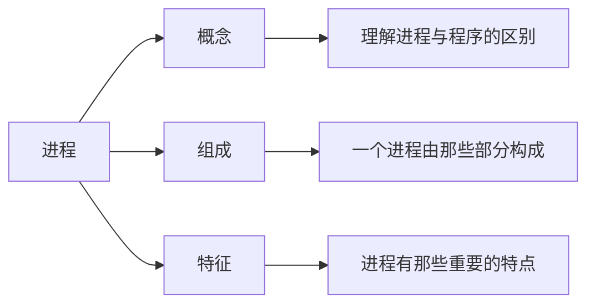

## 进程的概念

程序： 是静态的， 就是个存放在磁盘里的**可执行文件**， 就是一系列的指令集合。

进程（Process） ： 是**动态**的， 是程序的一次执行过程  

同一个程序多次执行会对应多个进程 

## PCB

当进程被创建时， 操作系统会为该进程分配一个**唯一的、 不重复**的“ 身份证号 ” —— **PID**（Process ID， 进程ID）  

操作系统要记录 PID、 进程所属 用户ID（UID），基本的进程描述信息， 可以让操作系统**区分各个进程**  

还要记录给**进程分配了哪些资源**（如： 分配了多少内存、 正在使用哪些I/O设备、 正在使用哪些文件），可用于实现操作系统对**资源的管理**  

还要记录进程的**运行情况**（如： CPU使用时间、 磁盘使用情况、 网络流量使用情况等），可用于实现操作系统对
**进程的控制、 调度**  

这些信息都被保存在一个**数据结构PCB** （ Process Control Block ） 中， 即**进程控制块**

操作系统需要对各个并发运行的进程进行管理， 但凡管理时所需要的信息， 都会被放在**PCB**中  

**PCB**是进程存在的**唯一标志**， 当进程被创建时， 操作系统为其创建PCB， 当进程结束时， 会回收其PCB

操作系统对进程进行管理工作所需的信息都存在PCB中    

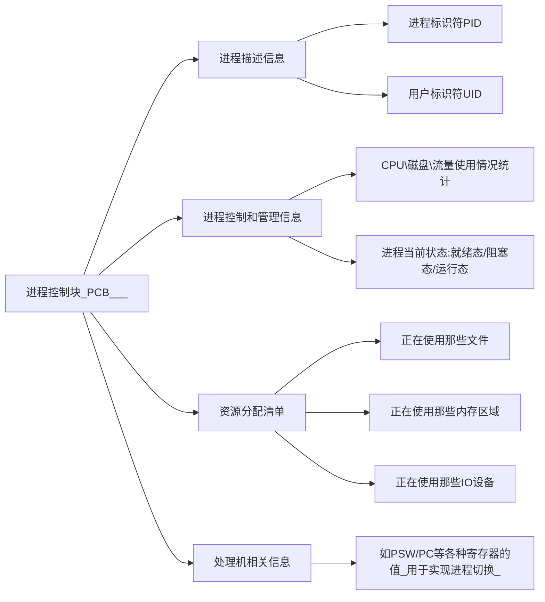

## 程序段、 数据段

PCB 是给操作系统用的  

程序段、 数据段是给进程自己用的  

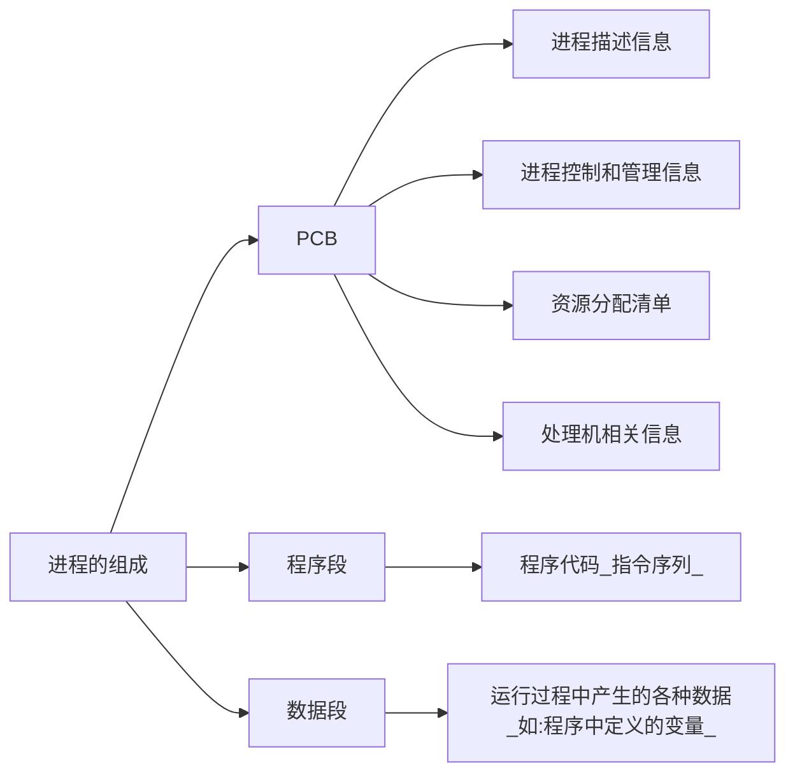

一个进程实体（进程映像） 由PCB、 程序段、 数据段组成  

进程是动态的， 进程实体（进程映像） 是静态的  

进程实体反应了进程在某一时刻的状态（如： x++后， x=2）  

程序段、 数据段、 PCB三部分组成了进程实体（进程映像）

引入进程实体的概念后， 可把进程定义为：

​		进程是进程实体的运行过程， 是系统进行资源分配和调度的一个独立单位。  一个进程被“ 调度 ” ， 就是指操作系统决定让这个进程上CPU运行  

注意： PCB是进程存在的唯一标志！  

## 进程的特征

**动态性**是进程最基本的特征  

**异步性**会导致并发程序执行结果的不确定性。  

**程序是静态**的， **进程是动态**的， 相比于程序， 进程拥有以下特征：  

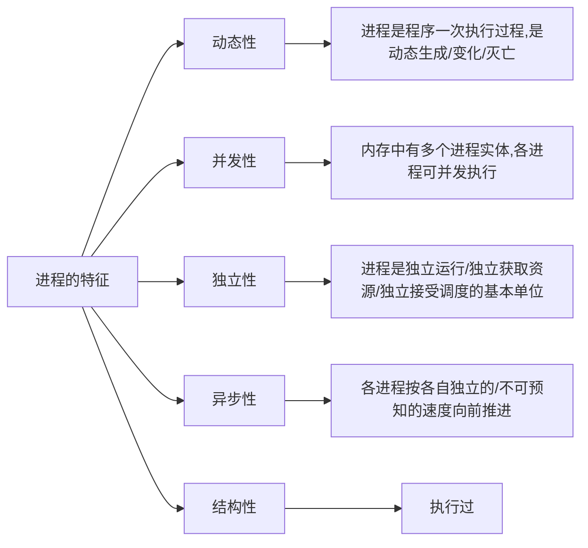

## 进程组织

在一个系统中， 通常有数十、 数百乃至数千个PCB。 为了能对他们加以有效的管理， 应该用适当的方式
把这些PCB组织起来

#### 链接方式

**执行指针** 指向当前处于运行态（执行态） 的进程  

单CPU计算机中， 同一时刻只会有一个进程处于运行态  

**就绪队列指针** 指向当前处于就绪态的进程  

**杜塞队列指针** 指向当前处于阻塞态的进程，很多操作系统还会根据阻塞原因不同， 再分为多个阻塞队列 

通常会把优先级高的进程放在队头  

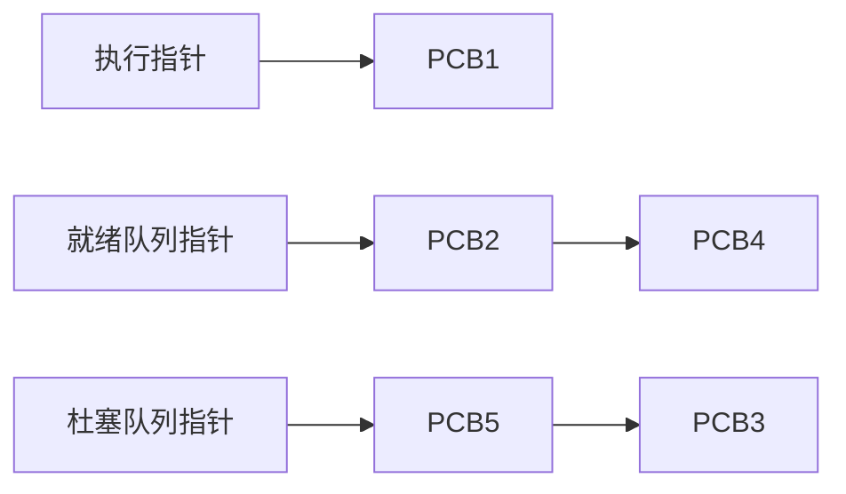

#### 索引方式：

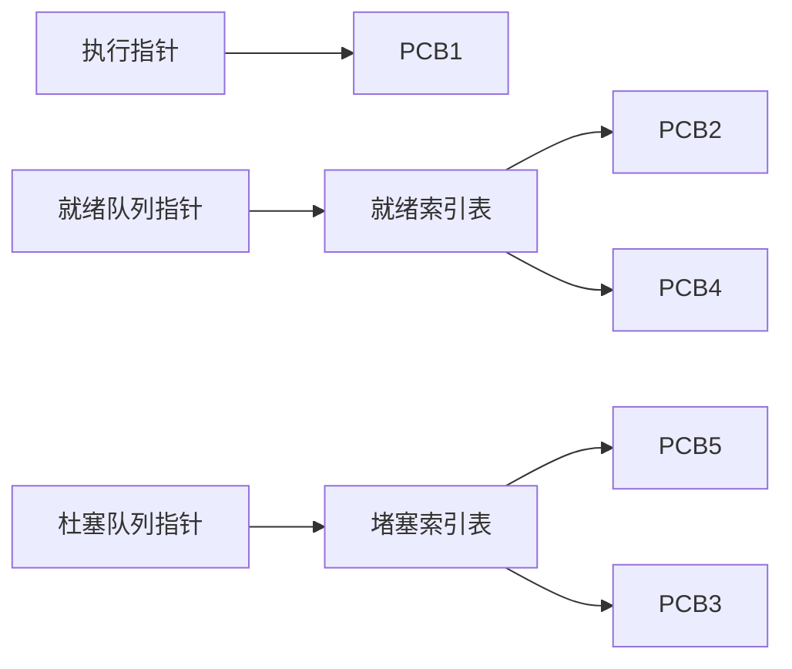

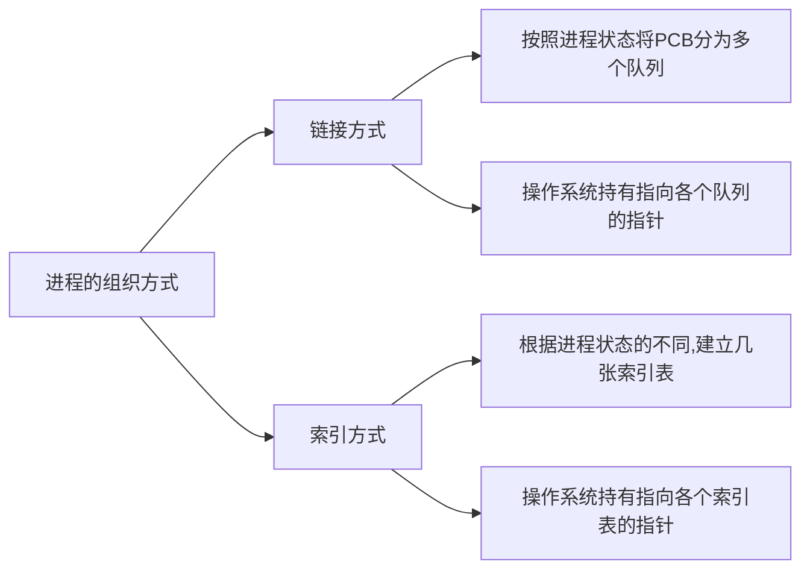

----------------------------------

# 进程的状态与转换

三种基本状态：运行态、就绪态、堵塞态

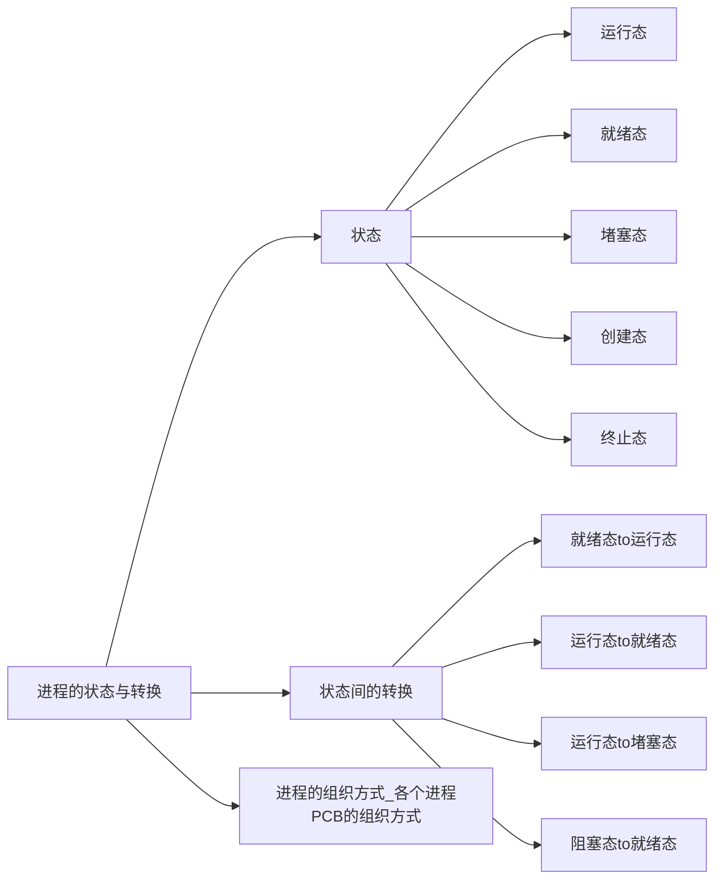

## 进程的状态——创建态、 就绪态 

进程正在被创建时， 它的状态是“**创建态**” ， 在这个阶段操作系统会为进程分配资源、 初始化PCB  

当进程创建完成后， 便进入“**就绪态**” ，处于就绪态的进程已经具备运行条件，但由于没有空闲CPU， 就暂时不能运行  

## 进程的状态——运行态

系统中可能会有很多个进程都处于**就绪态**  

当CPU空闲时， 操作系统就会选择一个就绪进程，让它上处理机运行  

在获得所需资源之前， 进程无法再往下执行  

如果一个进程此时在CPU上运行， 那么这个进程处于“ **运行态** ” 。CPU会执行该进程对应的程序（执行指令序列） 

## 进程的状态——阻塞态  

当等待的事件发生时， 进程从“**阻塞态**” 回到 “**就绪态**”  

在进程运行的过程中， 可能会请求等待某个事件的发生（如等待某种系统资源的分配， 或者等待其他进程的响应） 。在这个事件发生之前， 进程无法继续往下执行， 此时操作系统会让这个进程下CPU， 并让它进入“阻塞态”当CPU空闲时， 又会选择另一个“**就绪态**” 进程上CPU运行  

## 进程的状态——终止态  

一个进程可以执行 **exit** 系统调用， 请求操作系统终止该进程。此时该进程会进入“ **终止态** ” ， 操作系统会让该进程下CPU，并回收内存空间等资源， 最后还要回收该进程的PCB。当终止进程的工作完成之后， 这个进程就彻底消失了  

## 进程状态的转换

注意： 不能由阻塞态直接转换为运行态，也不能由就绪态直接转换为阻塞态（因为进入阻塞态是进程主动请求的， 必然需要进程在运行时才能发出这种请求）  

## 进程的状态

进程的整个生命周期中，大部分时间都处于三种基本状态

单CPU情况下，同一时刻只会有个进程处于**运行态**，多核CPU情况下，可能有多个进程处于**运行态**

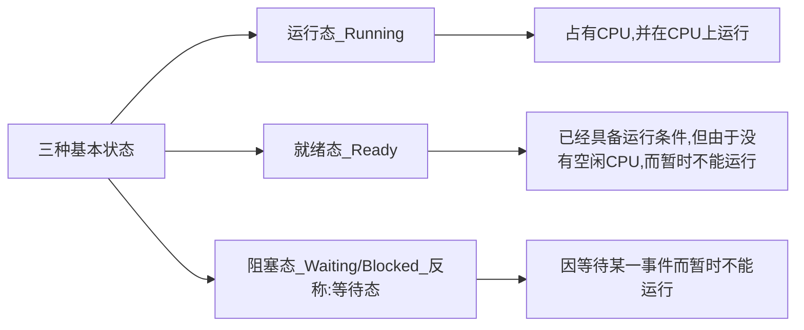

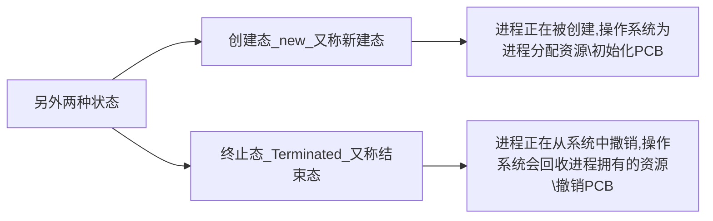

进程PCB中，会有一个变量 **state** 来表示**进程的当前状态**。如：1表示**创建态**、2表示**就绪态**、3表示**运行态**

为了对同一个状态下的各个进程进行统一的管理，操作系统会将各个进程的PCB组织起来

## 进程的组织

## 进程的状态——三种基本状态

进程是程序的一次执行。在这个执行过程中，有时进程正在被CPU处理，有时又需要等待CPU服务，可见进程的状态是会有各种变化。为了方便对各个进程的管理，操作系统需要将进程合理地划分为几种状态

进程的三种基本状态：

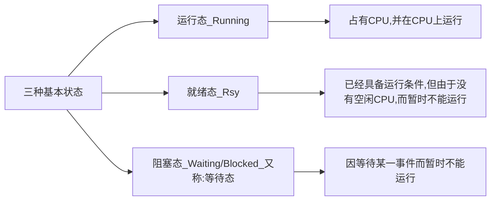

注意：单核处理机环境下，每一时刻最多只有一个进程处于运行

进程已经拥有了除处理机之外所时刻有需要的资源，一旦获得处理机，即可立即进入运行态开始运行，即: 万事俱备, 只欠CPU

如:等待操作系统分配打印机、等待读磁盘操作的结果。CPU是最昂贵的部件, 为了提高CPU的利用率, 需要先将其他进程需要的资源分配到位,  才能得到CPU的服务 

## 进程的状态——另外两种状态  

进程运行结束（或者由于bug导致进程无法继续执行下去， 比如数组越界错误） ， 需要撤销进程。  

操作系统需要完成创建进程。 操作系统为该进程分配所需的内存空间等系统资源， 并为其创建、初始化PCB（如： 为进程分配 PID）

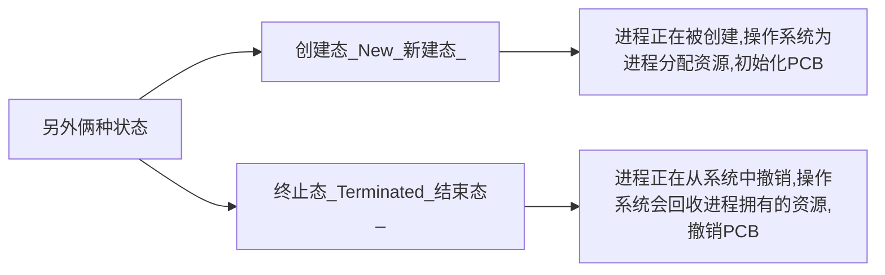

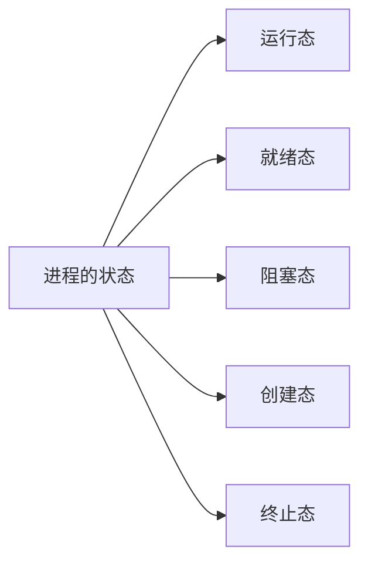

-------------------------------

# 进程控制

进程控制的主要功能是对系统中的所有进程实施有效的管理， 它具有**创建新进程**、 **撤销**已有进程、 实现进程状态**转换**等功能。  

进程控制就是要实现进程状态转换  

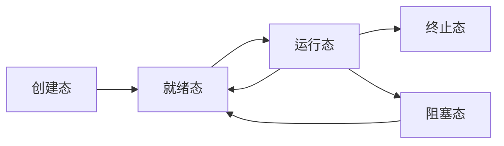

 