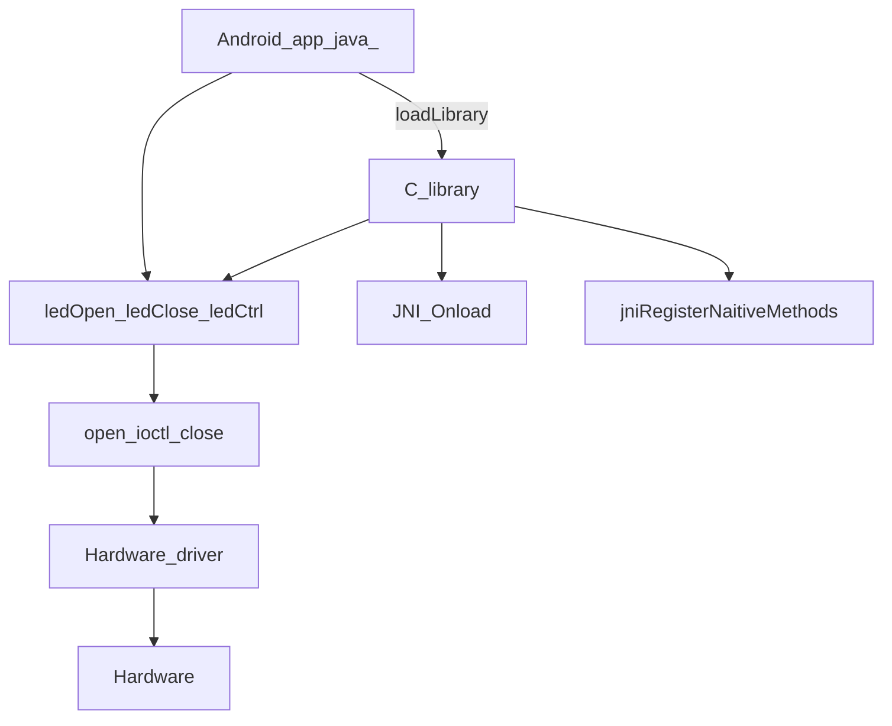
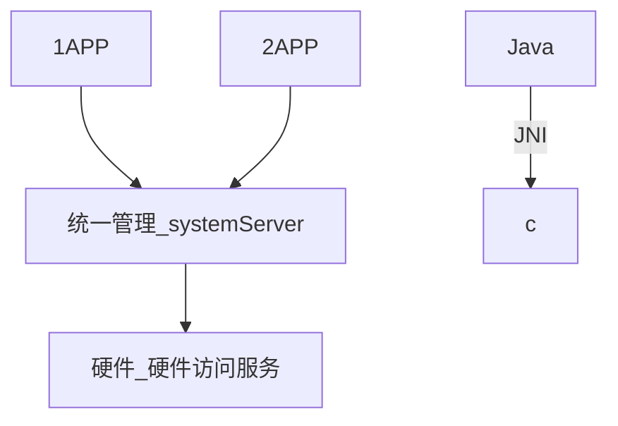

------


## 工具

使用Android Studio来阅读Android源码

```shell
mmm development/tools/idegen/

mv ./out/target/product/tiny4412/obj/GYP/shared_intermediates/res.java ./out/target/product/tiny4412/obj/GYP/shared_intermediates/res.j

sh ./development/tools/idegen/idegen.sh
```


参考文章

使用Android Studio查看Android Lollipop源码

如何使用Android Studio开发/调试Android源码


UML工具 : 

查看 servicemanager的类图

L:\android_projects\android_system_code\frameworks\native\include\binder

L:\android_projects\android_system_code\frameworks\native\libs\binder

L:\android_projects\android_system_code\frameworks\rs\server

UML中关联，聚合，组合的区别及C++实现

学习UML实现、泛化、依赖、关联、聚合、组合

使用bouml制作时序图


------


## 实现按钮和复选框


```java
package com.thisway.app_0001_leddemo;

import android.support.v7.app.AppCompatActivity;
import android.os.Bundle;
import android.view.Menu;
import android.view.MenuItem;
import android.widget.Button;
import android.view.View;
import android.widget.CheckBox;
import android.widget.Toast;

public class MainActivity extends AppCompatActivity {

    private boolean ledon = false;
    private Button button = null;
    private CheckBox checkBoxLed1 = null;
    private CheckBox checkBoxLed2 = null;
    private CheckBox checkBoxLed3 = null;
    private CheckBox checkBoxLed4 = null;

    class MyButtonListener implements View.OnClickListener 
    {
        @Override
        public void onClick(View v) 
        {
            //灯标准翻转
            ledon = !ledon;
            if (ledon) 
            {
                button.setText("ALL OFF");
                //全部打开
                checkBoxLed1.setChecked(true);
                checkBoxLed2.setChecked(true);
                checkBoxLed3.setChecked(true);
                checkBoxLed4.setChecked(true);
            }
            else 
            {
                button.setText("ALL ON");
                //全部关闭
                checkBoxLed1.setChecked(false);
                checkBoxLed2.setChecked(false);
                checkBoxLed3.setChecked(false);
                checkBoxLed4.setChecked(false);
            }
        }
    }

    public void onCheckboxClicked(View view) 
    {
        // Is the view now checked?
        boolean checked = ((CheckBox) view).isChecked();

        // Check which checkbox was clicked
        switch(view.getId()) 
        {
            case R.id.LED1:
                if (checked) 
                {
                    // Put some meat on the sandwich
                    Toast.makeText(getApplicationContext(), "LED1 on", Toast.LENGTH_SHORT).show();
                }
                else 
                {
                    // Remove the meat
                    Toast.makeText(getApplicationContext(), "LED1 off", Toast.LENGTH_SHORT).show();
                }
                break;
            case R.id.LED2:
                if (checked) 
                {
                    // Put some meat on the sandwich
                    Toast.makeText(getApplicationContext(), "LED2 on", Toast.LENGTH_SHORT).show();
                }
                else 
                {
                    // Remove the meat
                    Toast.makeText(getApplicationContext(), "LED2 off", Toast.LENGTH_SHORT).show();
                }
                break;

            case R.id.LED3:
                if (checked) 
                {
                    // Put some meat on the sandwich
                    Toast.makeText(getApplicationContext(), "LED3 on", Toast.LENGTH_SHORT).show();
                }
                else {
                    // Remove the meat
                    Toast.makeText(getApplicationContext(), "LED3 off", Toast.LENGTH_SHORT).show();
                }
                break;

            case R.id.LED4:
                if (checked) {
                    // Put some meat on the sandwich
                    Toast.makeText(getApplicationContext(), "LED4 on", Toast.LENGTH_SHORT).show();
                }
                else {
                    // Remove the meat
                    Toast.makeText(getApplicationContext(), "LED4 off", Toast.LENGTH_SHORT).show();
                }
                break;
            // TODO: Veggie sandwich
        }
    }
    @Override
    protected void onCreate(Bundle savedInstanceState) 
    {
        super.onCreate(savedInstanceState);
        setContentView(R.layout.activity_main);
	
        //alt + F7 可找到引用内容的位置
        button = (Button) findViewById(R.id.BUTTON);

        //获取s'you
        checkBoxLed1 = (CheckBox) findViewById(R.id.LED1);
        checkBoxLed2 = (CheckBox) findViewById(R.id.LED2);
        checkBoxLed3 = (CheckBox) findViewById(R.id.LED3);
        checkBoxLed4 = (CheckBox) findViewById(R.id.LED4);

        button.setOnClickListener(new MyButtonListener());
/*
        button.setOnClickListener(new View.OnClickListener() {
            public void onClick(View v) {
                // Perform action on click
                ledon = !ledon;
                if (ledon)
                    button.setText("ALL OFF");
                else
                    button.setText("ALL ON");
            }
        });
*/
    }

    @Override
    public boolean onCreateOptionsMenu(Menu menu) {
        // Inflate the menu; this adds items to the action bar if it is present.
        getMenuInflater().inflate(R.menu.menu_main, menu);
        return true;
    }

    @Override
    public boolean onOptionsItemSelected(MenuItem item) {
        // Handle action bar item clicks here. The action bar will
        // automatically handle clicks on the Home/Up button, so long
        // as you specify a parent activity in AndroidManifest.xml.
        int id = item.getItemId();

        //noinspection SimplifiableIfStatement
        if (id == R.id.action_settings) {
            return true;
        }

        return super.onOptionsItemSelected(item);
    }
}

```

```xml
<!--
	LinearLayout: 水平摆放
	orientation="vertical" 垂直摆放
-->
<LinearLayout 
    xmlns:android="http://schemas.android.com/apk/res/android"
    xmlns:tools="http://schemas.android.com/tools" 
    android:layout_width="match_parent"
    android:layout_height="match_parent" 
    android:paddingLeft="@dimen/activity_horizontal_margin"
    android:paddingRight="@dimen/activity_horizontal_margin"
    android:paddingTop="@dimen/activity_vertical_margin"
    android:paddingBottom="@dimen/activity_vertical_margin" 
    tools:context=".MainActivity"
    android:orientation="vertical"
    >

    <!--
		TextView: 控件
		text:显示的文本内容
	-->
    <TextView 
        android:text="cpucode, for LEDDemo"
        android:layout_width="wrap_content"
    	android:layout_height="wrap_content" 
         />
	<!--
		shift + F1 打开设计文档
		android:id="@+id/BUTTON" :Button的ID
		layout_width="fill_parent" :宽度全部填充
		text:显示的文本内容
	-->
    <Button
        android:id="@+id/BUTTON"
        android:layout_width="fill_parent"
        android:layout_height="wrap_content"
        android:text="ALL ON"
        />

    <CheckBox
        android:id="@+id/LED1"
        android:layout_width="fill_parent"
        android:layout_height="wrap_content"
        android:text="LED1"
        android:onClick="onCheckboxClicked"
        />

    <CheckBox
        android:id="@+id/LED2"
        android:layout_width="fill_parent"
        android:layout_height="wrap_content"
        android:text="LED2"
        android:onClick="onCheckboxClicked"
        />

    <CheckBox
        android:id="@+id/LED3"
        android:layout_width="fill_parent"
        android:layout_height="wrap_content"
        android:text="LED3"
        android:onClick="onCheckboxClicked"
        />

    <CheckBox
        android:id="@+id/LED4"
        android:layout_width="fill_parent"
        android:layout_height="wrap_content"
        android:text="LED4"
        android:onClick="onCheckboxClicked"
        />

</LinearLayout>
```


------


## app访问c库


```xml
<LinearLayout xmlns:android="http://schemas.android.com/apk/res/android"
    xmlns:tools="http://schemas.android.com/tools" android:layout_width="match_parent"
    android:layout_height="match_parent" android:paddingLeft="@dimen/activity_horizontal_margin"
    android:paddingRight="@dimen/activity_horizontal_margin"
    android:paddingTop="@dimen/activity_vertical_margin"
    android:paddingBottom="@dimen/activity_vertical_margin" tools:context=".MainActivity"
    android:orientation="vertical"
    >

    <TextView android:text="www.100ask.net, 100ask.taobao.com, for LEDDemo"
        android:layout_width="wrap_content"
    android:layout_height="wrap_content" />

    <Button
        android:id="@+id/BUTTON"
        android:layout_width="fill_parent"
        android:layout_height="wrap_content"
        android:text="ALL ON"
        />

    <CheckBox
        android:id="@+id/LED1"
        android:layout_width="fill_parent"
        android:layout_height="wrap_content"
        android:text="LED1"
        android:onClick="onCheckboxClicked"
        />

    <CheckBox
        android:id="@+id/LED2"
        android:layout_width="fill_parent"
        android:layout_height="wrap_content"
        android:text="LED2"
        android:onClick="onCheckboxClicked"
        />

    <CheckBox
        android:id="@+id/LED3"
        android:layout_width="fill_parent"
        android:layout_height="wrap_content"
        android:text="LED3"
        android:onClick="onCheckboxClicked"
        />

    <CheckBox
        android:id="@+id/LED4"
        android:layout_width="fill_parent"
        android:layout_height="wrap_content"
        android:text="LED4"
        android:onClick="onCheckboxClicked"
        />

</LinearLayout>

```


```java
package com.thisway.app_0001_leddemo;

import android.support.v7.app.AppCompatActivity;
import android.os.Bundle;
import android.view.Menu;
import android.view.MenuItem;
import android.widget.Button;
import android.view.View;
import android.widget.CheckBox;
import android.widget.Toast;
import com.thisway.hardlibrary.*;

public class MainActivity extends AppCompatActivity {

    private boolean ledon = false;
    private Button button = null;
    private CheckBox checkBoxLed1 = null;
    private CheckBox checkBoxLed2 = null;
    private CheckBox checkBoxLed3 = null;
    private CheckBox checkBoxLed4 = null;

    class MyButtonListener implements View.OnClickListener {
        @Override
        public void onClick(View v) {
            ledon = !ledon;
            if (ledon) {
                button.setText("ALL OFF");
                checkBoxLed1.setChecked(true);
                checkBoxLed2.setChecked(true);
                checkBoxLed3.setChecked(true);
                checkBoxLed4.setChecked(true);

                for (int i = 0; i < 4; i++)
                    HardControl.ledCtrl(i, 1);
            }
            else {
                button.setText("ALL ON");
                checkBoxLed1.setChecked(false);
                checkBoxLed2.setChecked(false);
                checkBoxLed3.setChecked(false);
                checkBoxLed4.setChecked(false);

                for (int i = 0; i < 4; i++)
                    HardControl.ledCtrl(i, 0);
            }
        }
    }

    public void onCheckboxClicked(View view) {
        // Is the view now checked?
        boolean checked = ((CheckBox) view).isChecked();

        // Check which checkbox was clicked
        switch(view.getId()) {
            case R.id.LED1:
                if (checked) {
                    // Put some meat on the sandwich
                    Toast.makeText(getApplicationContext(), "LED1 on", Toast.LENGTH_SHORT).show();
                    HardControl.ledCtrl(0, 1);
                }
                else {
                    // Remove the meat
                    Toast.makeText(getApplicationContext(), "LED1 off", Toast.LENGTH_SHORT).show();
                    HardControl.ledCtrl(0, 0);
                }
                break;
            case R.id.LED2:
                if (checked) {
                    // Put some meat on the sandwich
                    Toast.makeText(getApplicationContext(), "LED2 on", Toast.LENGTH_SHORT).show();
                    HardControl.ledCtrl(1, 1);
                }
                else {
                    // Remove the meat
                    Toast.makeText(getApplicationContext(), "LED2 off", Toast.LENGTH_SHORT).show();
                    HardControl.ledCtrl(1, 0);
                }
                break;

            case R.id.LED3:
                if (checked) {
                    // Put some meat on the sandwich
                    Toast.makeText(getApplicationContext(), "LED3 on", Toast.LENGTH_SHORT).show();
                    HardControl.ledCtrl(2, 1);
                }
                else {
                    // Remove the meat
                    Toast.makeText(getApplicationContext(), "LED3 off", Toast.LENGTH_SHORT).show();
                    HardControl.ledCtrl(2, 0);
                }
                break;

            case R.id.LED4:
                if (checked) {
                    // Put some meat on the sandwich
                    Toast.makeText(getApplicationContext(), "LED4 on", Toast.LENGTH_SHORT).show();
                    HardControl.ledCtrl(3, 1);
                }
                else {
                    // Remove the meat
                    Toast.makeText(getApplicationContext(), "LED4 off", Toast.LENGTH_SHORT).show();
                    HardControl.ledCtrl(3, 0);
                }
                break;
            // TODO: Veggie sandwich
        }
    }
    @Override
    protected void onCreate(Bundle savedInstanceState) {
        super.onCreate(savedInstanceState);
        setContentView(R.layout.activity_main);

        button = (Button) findViewById(R.id.BUTTON);

        HardControl.ledOpen();

        checkBoxLed1 = (CheckBox) findViewById(R.id.LED1);
        checkBoxLed2 = (CheckBox) findViewById(R.id.LED2);
        checkBoxLed3 = (CheckBox) findViewById(R.id.LED3);
        checkBoxLed4 = (CheckBox) findViewById(R.id.LED4);

        button.setOnClickListener(new MyButtonListener());
/*
        button.setOnClickListener(new View.OnClickListener() {
            public void onClick(View v) {
                // Perform action on click
                ledon = !ledon;
                if (ledon)
                    button.setText("ALL OFF");
                else
                    button.setText("ALL ON");
            }
        });
*/
    }

    @Override
    public boolean onCreateOptionsMenu(Menu menu) {
        // Inflate the menu; this adds items to the action bar if it is present.
        getMenuInflater().inflate(R.menu.menu_main, menu);
        return true;
    }

    @Override
    public boolean onOptionsItemSelected(MenuItem item) 
    {
        // Handle action bar item clicks here. The action bar will
        // automatically handle clicks on the Home/Up button, so long
        // as you specify a parent activity in AndroidManifest.xml.
        int id = item.getItemId();

        //noinspection SimplifiableIfStatement
        if (id == R.id.action_settings) 
        {
            return true;
        }

        return super.onOptionsItemSelected(item);
    }
}

```


```java
package com.thisway.hardlibrary;

public class HardControl 
{
    public static native int ledCtrl(int which, int status);
    public static native int ledOpen();
    public static native void ledClose();

    static 
    {
        try {
            System.loadLibrary("hardcontrol");
        } catch (Exception e) {
            e.printStackTrace();
        }
    }

}
```


```c
//hardcontrol.c
#include <jni.h>  /* /usr/lib/jvm/java-1.7.0-openjdk-amd64/include/ */
#include <stdio.h>
#include <stdlib.h>
c
#include <android/log.h>  /* liblog */

//__android_log_print(ANDROID_LOG_DEBUG, "JNIDemo", "native add ...");

 
#if 0
typedef struct 
{
    char *name;          /* Java里调用的函数名 */
    char *signature;    /* JNI字段描述符, 用来表示Java里调用的函数的参数和返回值类型 */
    void *fnPtr;          /* C语言实现的本地函数 */
} JNINativeMethod;
#endif

jint ledOpen(JNIEnv *env, jobject cls)
{
	__android_log_print(ANDROID_LOG_DEBUG, "LEDDemo", "native ledOpen ...");
	return 0;
}

void ledClose(JNIEnv *env, jobject cls)
{
	__android_log_print(ANDROID_LOG_DEBUG, "LEDDemo", "native ledClose ...");
}


jint ledCtrl(JNIEnv *env, jobject cls, jint which, jint status)
{
	__android_log_print(ANDROID_LOG_DEBUG, "LEDDemo", "native ledCtrl : %d, %d", which, status);
	return 0;
}


static const JNINativeMethod methods[] = {
	{"ledOpen", "()I", (void *)ledOpen},
	{"ledClose", "()V", (void *)ledClose},
	{"ledCtrl", "(II)I", (void *)ledCtrl},
};

/* System.loadLibrary */
JNIEXPORT jint JNICALL
JNI_OnLoad(JavaVM *jvm, void *reserved)
{
	JNIEnv *env;
	jclass cls;

	if ((*jvm)->GetEnv(jvm, (void **)&env, JNI_VERSION_1_4)) {
		return JNI_ERR; /* JNI version not supported */
	}
	cls = (*env)->FindClass(env, "com/thisway/hardlibrary/HardControl");
	if (cls == NULL) {
		return JNI_ERR;
	}

	/* 2. map java hello <-->c c_hello */
	if ((*env)->RegisterNatives(env, cls, methods, sizeof(methods)/sizeof(methods[0])) < 0)
		return JNI_ERR;

	return JNI_VERSION_1_4;
}
```


```c
// app/build.gradle
apply plugin: 'com.android.application'

android {
    compileSdkVersion 22
    buildToolsVersion "22.0.1"

    defaultConfig {
        applicationId "com.thisway.app_0001_leddemo"
        minSdkVersion 15
        targetSdkVersion 22
        versionCode 1
        versionName "1.0"
    }
    sourceSets {
        main {
            jniLibs.srcDirs = ['libs']
        }
    }
    buildTypes {
        release {
            minifyEnabled false
            proguardFiles getDefaultProguardFile('proguard-android.txt'), 'proguard-rules.pro'
        }
    }
}

dependencies {
    compile fileTree(dir: 'libs', include: ['*.jar'])
    compile 'com.android.support:appcompat-v7:22.2.1'
}
```


编译c库

编译错误:

```shell
$ arm-linux-gcc-fpiC-shared hardcotrolc-o ibhardcotro.so
# hardcotrol. c: 2: 71: fatal error: ini.h: No such file or directory compilation terminated
$ arm-linux-gcc -fPIC -shared hardcontrol.c -o libhardcontrol.so -I /usr/lib/jvm/java-1.7.0-openjdk-amd64/include/
```


如果出现错误可以看这

```shell
# couldn't find "libhardcontrol.so"
```


查看这个目录下 app-debug.apk

>   app/build/outputs/apk/app-debug.apk

用解压包 打开 app-debug.apk 查看 libhardcontrol.so

>   app-debug.apk\lib\armeabi


使用这个不会使用标准的libc库, 所以要指定


查看一个libc的库


找一个版本高的libc库


编译错误:


搜索log.h包


出现这个错误:


查找 liblog 的库


```shell
arm-linux-gcc -fPIC -shared hardcontrol.c -o libhardcontrol.so -I /usr/lib/jvm/java-1.7.0-openjdk-amd64/include/  -nostdlib /work/android-5.0.2/prebuilts/ndk/9/platforms/android-19/arch-arm/usr/lib/libc.so -I /work/android-5.0.2/prebuilts/ndk/9/platforms/android-19/arch-arm/usr/include /work/android-5.0.2/prebuilts/ndk/9/platforms/android-19/arch-arm/usr/lib/liblog.so
```

把编译好的 .so文件放在  app/llibs/armeabi 文件下


------


## 控制LED

open 控制 led_open

read 控制 led_read

write 控制led_write

ioctl 控制led_ioctl

linux驱动的实现 接口 file_oprations 

.open 

.read

.write

.ioctl


注册

register_chrdev()

驱动入口 和驱动出口

leds_4412.c

```c
/*
把 leds_4412.c 放到drivers/leds
修改 drivers/leds/Makefile:
obj-y += leds_4412.o

重新配置内核
make menuconfig

CONFIG_LEDS_CLASS
CONFIG_LEDS_TRIGGERS
CONFIG_LEDS_TRIGGER_TIMER

-> Device Drivers
  -> LED Support
   [*]   LED Class Support    
   [*]   LED Trigger support
   <*>   LED Timer Trigger
   
重新编译内核
*/
#include <linux/kernel.h>
#include <linux/module.h>
#include <linux/miscdevice.h>
#include <linux/device.h>
#include <linux/fs.h>
#include <linux/types.h>
#include <linux/moduleparam.h>
#include <linux/slab.h>
#include <linux/ioctl.h>
#include <linux/cdev.h>
#include <linux/delay.h>
#include <linux/gpio.h>
#include <mach/gpio.h>
#include <plat/gpio-cfg.h>

#include <linux/leds.h>

struct led_desc 
{
	int gpio;
	char *name;
};

static struct led_desc led_gpios[] = {
	{EXYNOS4212_GPM4(0), "led1"},
	{EXYNOS4212_GPM4(1), "led2"},
	{EXYNOS4212_GPM4(2), "led3"},
	{EXYNOS4212_GPM4(3), "led4"},
};

struct led_classdev_4412 
{
	struct led_classdev cdev;
	int gpio;
};


static struct led_classdev_4412 *led_devs;

static void	 brightness_set_4412(struct led_classdev *led_cdev,
			  enum led_brightness brightness)
{
	struct led_classdev_4412 *dev = (struct led_classdev_4412 *)led_cdev;

	led_cdev->brightness = brightness;

	if (brightness != LED_OFF)
    {
        gpio_set_value(dev->gpio, 0);
    }	
	else
    {
        gpio_set_value(dev->gpio, 1);
    }
}


static int leds_init(void)
{
	int i;
	int ret;
	
	/* 1. alloc led_classdev */
	led_devs = kzalloc(sizeof(struct led_classdev_4412) * sizeof(led_gpios)/sizeof(led_gpios[0]), GFP_KERNEL);
	if (led_devs == NULL) 
    {
		printk("No memory for device\n");
		return -ENOMEM;
	}
	
	for (i = 0; i < sizeof(led_gpios)/sizeof(led_gpios[0]); i++)
	{
		//设置gpio的模式
		s3c_gpio_cfgpin(led_gpios[i].gpio, S3C_GPIO_OUTPUT);
        //状态
		gpio_set_value(led_gpios[i].gpio, 1);

		/* 2. set */
		led_devs[i].cdev.max_brightness = LED_FULL;
		led_devs[i].cdev.brightness_set = brightness_set_4412;
		led_devs[i].cdev.flags = LED_CORE_SUSPENDRESUME;
		led_devs[i].cdev.brightness = LED_OFF;
		led_devs[i].cdev.name = led_gpios[i].name;
		//led_devs[i].cdev.default_trigger = "timer";
		led_devs[i].gpio = led_gpios[i].gpio;

		/* 3. led_classdev_register */
		ret = led_classdev_register(NULL, &led_devs[i].cdev);
		if (ret) 
        {
			i--;
            
			while (i >= 0) 
            {
				led_classdev_unregister(&led_devs[i].cdev);
				i--;
			}
			kfree(led_devs);
			return -EIO;
		}
	}
	
	return 0;
}

static void leds_exit(void)
{
	int i;
	for (i = 0; i < sizeof(led_gpios)/sizeof(led_gpios[0]); i++)
	{
		led_classdev_unregister(&led_devs[i].cdev);
	}
	kfree(led_devs);
}

module_init(leds_init);
module_exit(leds_exit);

MODULE_LICENSE("GPL");
MODULE_AUTHOR("cpucode");
```


写完驱动


编译Linux内核

在 Windows 下双击“Android-5.0.2.part1.rar” 解压，得到 android-5.0.2-fs-20150325.tar.gz，把它放到 Ubuntu 的/work 目录下再次解压。

在 Ubuntu 下的解压 Android 文件系统， 命令为：

```shell
tar xzf android-5.0.2-fs-20150325.tar.gz
```


在 Ubuntu 下的解压内核并编译，命令为：

```c
 tar xzf linux-3.0.86-20150324.tgz

 cd linux-3.0.86/

 cp tiny4412_android_defconfig .config

make zImage  
```

将编译文件传到win系统下等编译


更新内核

参考“2.4.1 安装 MiniTools 工具”安装 MiniTools

(2) 准备 SD 卡：

① 参考“2.2 制作用于安装系统的 SD 卡”， 制作一个 SD 卡；

② 参考“2.2.4 复制光盘的 images 目录到 SD 卡上”复制文件到 SD 卡上；

③ 参 考 “2.4.2 使 用 USB 烧 写 系 统 前 的 准 备 工 作 ” ， 编 辑 SD 卡 中 的 文 件

images/FriendlyARM.ini 文件文件，增加以下内容：

USB-Mode = yes

(3) 把 SD 卡插到开发板上， 并设为 SD 卡启动(参考“2.1.1 启动模式选择”)

(4) 用 USB 线连接电脑和开发板

(5) 启动 MiniTools， 在左侧选择“Android”，勾选“Android kernel”，选择要烧写的 zImage，最后点击“Start flashing”， 如下图所示：  


板子里


就可以看见led的设备节点


修改c库 app里访问C库 : JNI

```c
#include <jni.h>  /* /usr/lib/jvm/java-1.7.0-openjdk-amd64/include/ */
#include <stdio.h>
#include <stdlib.h>
#include <sys/types.h>
#include <sys/stat.h>
#include <fcntl.h>
#include <sys/ioctl.h>

#include <android/log.h>  /* liblog */

//__android_log_print(ANDROID_LOG_DEBUG, "JNIDemo", "native add ...");

#if 0
typedef struct 
{
    char *name;          /* Java里调用的函数名 */
    char *signature;    /* JNI字段描述符, 用来表示Java里调用的函数的参数和返回值类型 */
    void *fnPtr;          /* C语言实现的本地函数 */
} JNINativeMethod;
#endif

static jint fd;

jint ledOpen(JNIEnv *env, jobject cls)
{
	fd = open("/dev/leds", O_RDWR);
	__android_log_print(ANDROID_LOG_DEBUG, "LEDDemo", "native ledOpen : %d", fd);
	if (fd >= 0)
		return 0;
	else
		return -1;
}

void ledClose(JNIEnv *env, jobject cls)
{
	__android_log_print(ANDROID_LOG_DEBUG, "LEDDemo", "native ledClose ...");
	close(fd);
}

jint ledCtrl(JNIEnv *env, jobject cls, jint which, jint status)
{
	int ret = ioctl(fd, status, which);
    //打印日志
	__android_log_print(ANDROID_LOG_DEBUG, "LEDDemo", "native ledCtrl : %d, %d, %d", which, status, ret);
	return ret;
}

static const JNINativeMethod methods[] = {
    //()I 返回int类型
	{"ledOpen", "()I", (void *)ledOpen},
    //()V 返回void类型
	{"ledClose", "()V", (void *)ledClose},
    //(II)I 俩个int参数 返回int
	{"ledCtrl", "(II)I", (void *)ledCtrl},
};

/* System.loadLibrary */
JNIEXPORT jint JNICALL
JNI_OnLoad(JavaVM *jvm, void *reserved)
{
	JNIEnv *env;
	jclass cls;

	if ((*jvm)->GetEnv(jvm, (void **)&env, JNI_VERSION_1_4)) {
		return JNI_ERR; /* JNI version not supported */
	}
    //安卓java存放的位置
	cls = (*env)->FindClass(env, "com/thisway/hardlibrary/HardControl");
	if (cls == NULL) {
		return JNI_ERR;
	}

	/* 2. map java hello <-->c c_hello */
    //sizeof(methods)/sizeof(methods[0]):接口个数
	if ((*env)->RegisterNatives(env, cls, methods, sizeof(methods)/sizeof(methods[0])) < 0)
		return JNI_ERR;

	return JNI_VERSION_1_4;
}
```

编译c库 

```shell
arm-linux-gcc -fPIC -shared hardcontrol.c -o libhardcontrol.so -I /usr/lib/jvm/java-1.7.0-openjdk-amd64/include/  -nostdlib /work/android-5.0.2/prebuilts/ndk/9/platforms/android-19/arch-arm/usr/lib/libc.so -I /work/android-5.0.2/prebuilts/ndk/9/platforms/android-19/arch-arm/usr/include /work/android-5.0.2/prebuilts/ndk/9/platforms/android-19/arch-arm/usr/lib/liblog.so
```


把编译文件.so 放在安卓开发目录下 

编译安卓程序


------


## 硬件服务






硬件服务流程

loadLibrary : 加载C库

JNI_Onload: 注册本地方法

分别调用各个硬件的函数来注册本地方法

LED

振动器

串口

server : 服务器提供

service : 服务

systemserve 对每个硬件 使用本地方法 : 构建service , addservice

APP怎么使用 : 获的服务 : getservice , 执行服务 : 执行 service方法


怎么实现硬件访问服务

1 JNI 和HAL

 通过 com_android_server_Ledservice.cpp 注册JNI本地方法

Jhi会加载 Hal_led.c : 里有函数 : open , read , write

2 修改 onload.cpp : 调用 JNI

修改systemServer.java : new Ledservice

.addservice

LedService.java 调用本地方法

ILedService.java : 给app使用


------


## 实现ILedService.java 接口

AIDL :

Android 接口定义语言 (AIDL) 与您可能使用过的其他接口语言 (IDL) 类似。您可以利用它定义客户端与服务均认可的编程接口，以便二者使用进程间通信 (IPC) 进行相互通信。在 Android 中，一个进程通常无法访问另一个进程的内存。因此，为进行通信，进程需将其对象分解成可供操作系统理解的原语，并将其编组为可供您操作的对象。编写执行该编组操作的代码较为繁琐，因此 Android 会使用 AIDL 为您处理此问题。


```java
/* frameworks/base/core/java/android/os/ILedService.aidl

在这个目录下找Android.mk
ls An 没有就
cd ..
ls An
直到找到 Android.mk

修改 frameworks/base/Android.mk  vim android.mk
查找 /.aidl
core/java/android/os/IVibratorService.aidl \
//翻造上面 添加 
core/java/android/os/ILedService.aidl \
//编译
mmm .

查找 ILedservice.java 生成文件
cd out/
find -name ILedservice.java
它会生成: ./out/target/common/obj/JAVA_LIBRARIES/framework_intermediates/src/core/java/android/os/ILedService.java

*/
package android.os;

/** {@hide} */
interface ILedService
{
	int ledCtrl(int which, int status);
}
```


自动生成的文件 : 

```java
// ./out/target/common/obj/JAVA_LIBRARIES/framework_intermediates/src/core/java/android/os/ILedService.java
/*
 * This file is auto-generated.  DO NOT MODIFY.
 * Original file: frameworks/base/./core/java/android/os/ILedService.aidl
 */
package android.os;
/** {@hide} */
public interface ILedService extends android.os.IInterface
{
/** Local-side IPC implementation stub class. */
public static abstract class Stub extends android.os.Binder implements android.os.ILedService
{
private static final java.lang.String DESCRIPTOR = "android.os.ILedService";
/** Construct the stub at attach it to the interface. */
public Stub()
{
this.attachInterface(this, DESCRIPTOR);
}
/**
 * Cast an IBinder object into an android.os.ILedService interface,
 * generating a proxy if needed.
 */
public static android.os.ILedService asInterface(android.os.IBinder obj)
{
if ((obj==null)) {
return null;
}
android.os.IInterface iin = obj.queryLocalInterface(DESCRIPTOR);
if (((iin!=null)&&(iin instanceof android.os.ILedService))) {
return ((android.os.ILedService)iin);
}
return new android.os.ILedService.Stub.Proxy(obj);
}
@Override public android.os.IBinder asBinder()
{
return this;
}
@Override public boolean onTransact(int code, android.os.Parcel data, android.os.Parcel reply, int flags) throws android.os.RemoteException
{
switch (code)
{
case INTERFACE_TRANSACTION:
{
reply.writeString(DESCRIPTOR);
return true;
}
case TRANSACTION_ledCtrl:
{
data.enforceInterface(DESCRIPTOR);
int _arg0;
_arg0 = data.readInt();
int _arg1;
_arg1 = data.readInt();
int _result = this.ledCtrl(_arg0, _arg1);
reply.writeNoException();
reply.writeInt(_result);
return true;
}
}
return super.onTransact(code, data, reply, flags);
}
private static class Proxy implements android.os.ILedService
{
private android.os.IBinder mRemote;
Proxy(android.os.IBinder remote)
{
mRemote = remote;
}
@Override public android.os.IBinder asBinder()
{
return mRemote;
}
public java.lang.String getInterfaceDescriptor()
{
return DESCRIPTOR;
}
@Override public int ledCtrl(int which, int status) throws android.os.RemoteException
{
android.os.Parcel _data = android.os.Parcel.obtain();
android.os.Parcel _reply = android.os.Parcel.obtain();
int _result;
try {
_data.writeInterfaceToken(DESCRIPTOR);
_data.writeInt(which);
_data.writeInt(status);
mRemote.transact(Stub.TRANSACTION_ledCtrl, _data, _reply, 0);
_reply.readException();
_result = _reply.readInt();
}
finally {
_reply.recycle();
_data.recycle();
}
return _result;
}
}
static final int TRANSACTION_ledCtrl = (android.os.IBinder.FIRST_CALL_TRANSACTION + 0);
}
public int ledCtrl(int which, int status) throws android.os.RemoteException;
}

```


```java

```


```java
//
package com.android.server;
import android.os.ILedService;

public class LedService extends ILedService.Stub {
    private static final String TAG = "LedService";

	/* call native c function to access hardware */
	public int ledCtrl(int which, int status) throws android.os.RemoteException
	{
		return native_ledCtrl(which, status);
	}

	public LedService() {
		native_ledOpen();
	}

	public static native int native_ledOpen();
	public static native void native_ledClose();
	public static native int native_ledCtrl(int which, int status);
}
```


### 编译 Android 系统

进入上述解压得到的 android-5.0.2， 执行以下命令(注意： “.”号后有一个空格)：

```shell
$ . setenv
```

再执行“ lunch ”命令， 输入“ full_tiny4412-eng ”前的数字标号， 如下所示：

```shell
$ lunch
```

```shell
You're building on Linux
Lunch menu... pick a combo:
1. aosp_arm-eng
2. aosp_arm64-eng
3. aosp_mips-eng
4. aosp_mips64-eng
5. aosp_x86-eng
6. aosp_x86_64-eng
7. full_tiny4412-userdebug
8. full_tiny4412-eng
9. aosp_mako-userdebug
10. aosp_hammerhead-userdebug
11. aosp_tilapia-userdebug
12. aosp_grouper-userdebug
13. aosp_deb-userdebug
14. full_fugu-userdebug
15. aosp_fugu-userdebug
16. aosp_flo-userdebug
17. aosp_shamu-userdebug
18. aosp_manta-userdebug
19. mini_emulator_mips-userdebug
20. mini_emulator_x86_64-userdebug
21. mini_emulator_arm64-userdebug
22. m_e_arm-userdebug
23. mini_emulator_x86-userdebug
Which would you like? [aosp_arm-eng] 8
```

接着执行“ make ”命令开始编译，也可以在 make 后加上“ -j ”参数 利用 CPU 的多核加快编译速度，比如在 8 核 CPU 上可以执行

```c
make –j8
```

注意： 编译过程可能持续 4、 5 个小时。

最后，执行以下命令生成映象文件：

```shell
$./gen-img.sh
```


注意： 如果提示如下错误，要先编译 u-boot 以得到 mkimage 工具， 方法见后。

```shell
./gen-img.sh: line 31: mkimage: command not found
```


编译 u-boot 以得到 mkimage 工具的方法：

```shell
$ tar xzf uboot_tiny4412-20130729.tgz
$ cd uboot_tiny4412/
$ make tiny4412_config
$ make
$ sudo cp tools/mkimage /usr/bin/
```


4.3.2 烧写 Android 系统

烧过内核了， SD 卡上的 images/FriendlyARM.ini 已经改为 USB MODE：

(1) 开发板设为 SD 卡启动，重新上电

(2) 用 USB 线连接电脑和开发板

(3) 启动 MiniTools， 在左侧选择“Android”，勾选“Android RootFs/System Image”，选择要烧写的 System.img，最后点击“Start flashing”， 如下图所示：  


