--------------------------

# 操作系统的 运行机制

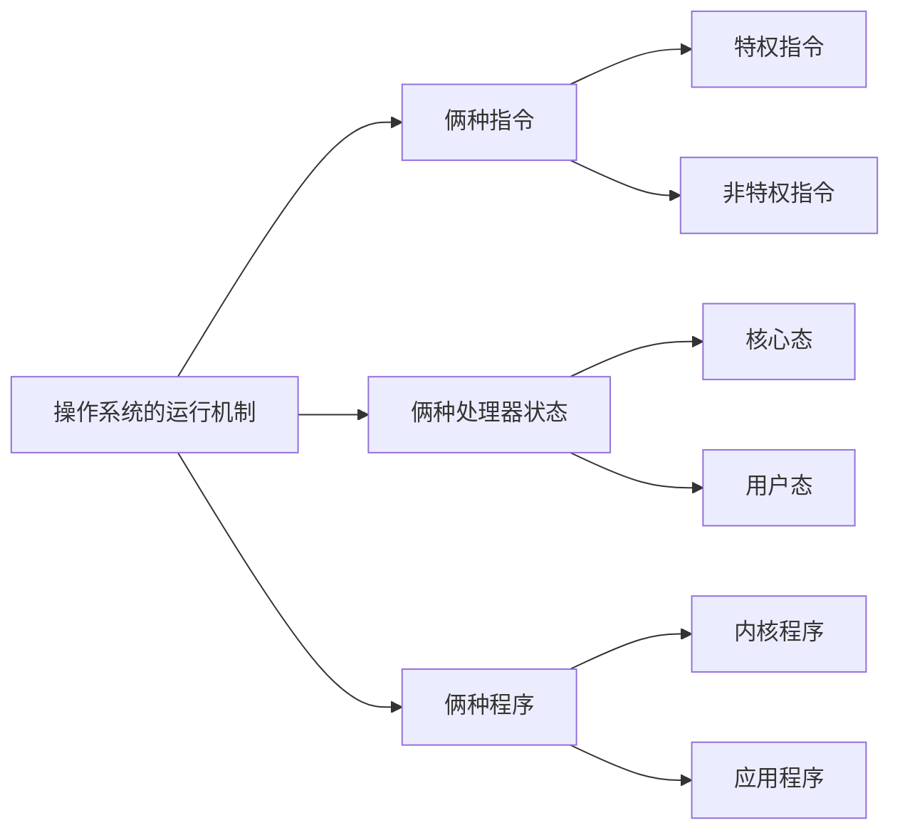
```mermaid
graph LR;
操作系统的运行机制 --> 俩种指令 --> 特权指令;
操作系统的运行机制 --> 俩种处理器状态 --> 核心态;
操作系统的运行机制 --> 俩种程序 --> 内核程序;
俩种指令 --> 非特权指令;
俩种处理器状态 --> 用户态;
俩种程序 --> 应用程序;
```


一条**高级语言**的代码翻译过来可能会对应多条机器指令 ：


```mermaid
graph LR;
C语言代码 --- 编译器:翻译 --> 机器指令:二进制;
```


“ **指令** ” ：处理器（CPU） 能识别、 执行的最基本命令

程序运行的过程其实就是CPU执行一条一条的机器指令的过程

注： 很多人习惯把 Linux、 Windows、 MacOS 的 “ 小黑框 ” 中使用的命令也称为“ 指令 ” ， 其实这是“ 交互式命令接口 ” ， 注意与本节的 “ 指令 ” 区别开。 此 “ 指令 ” 指**二进制机器指令**  

## 内核程序  & 应用程序

我们普通程序员写的程序就是“ 应用程序 ”

微软、 苹果有一帮人负责实现操作系统， 他们写的是“ **内核程序** ”

由很多内核程序组成了“ **操作系统内核** ” ， 或简称“ **内核**（Kernel） ”

**内核**是操作系统最重要最核心的部分， 也是最接近硬件的部分甚至可以说， 一个操作系统只要有内核就够了（eg： Docker—>仅需Linux内核）

操作系统的功能未必都在内核中， 如图形化用户界面 GUI 

##特权指令 & 非特权指令

应用程序只能使用“ **非特权指令** ” ， 如：加法指令、 减法指令等

操作系统内核作为 “管理者” ， 有时会让CPU执行一些“特权指令” ， 如： 内存清零指令。 这些指令影响重大，只允许“ 管理者 ” —— 即操作系统内核来使用  

在CPU设计和生产的时候就划分了 **特权指令**和**非特权指令**， 因此CPU执行一条指令前就能判断出其类型  

## 内核态 & 用户态

CPU 有两种状态， “**内核态**” 和“**用户态**”

处于**内核态**时， 说明此时正在运行的是**内核程序**， 此时可以执行**特权**指令

处于**用户态**时， 说明此时正在运行的是**应用程序**， 此时只能执行**非特权**指令  

拓展： CPU 中有一个寄存器叫 **程序状态字寄存器**（PSW） ， 其中有个二进制位， 1 表示“ 内核态 ” ， 0 表示“ 用户态 ”

别名： 内核态 = 核心态 = 管态； 用户态 = 目态  

## 内核态、 用户态 的切换

**内核态**  ->  **用户态**： 执行一条特权指令——修改PSW的标志位为“ **用户态** ” ， 这个动作意味着操作系统将主动让出CPU使用权

**用户态**  -> **内核态**： 由“ 中断 ” 引发， 硬件自动完成变态过程， 触发中断信号意味着操作系统将强行夺回CPU的使用权

除了非法使用特权指令之外， 还有很多事件会**触发中断信号**。 一个共性是， 但凡需要操作系统介入的地方， 都会触发中断信号   

启动过程：

-   刚开机时， CPU 为“ **内核态** ” ， 操作系统内核程序先上CPU运行

-   开机完成后， 用户可以启动某个应用程序

-   操作系统内核程序在合适的时候主动让出 CPU， 让该应用程序上CPU运行，操作系统内核在让出CPU之前， 会用一条特权指令把 **PSW** 的标志位设置为“ **用户态** ”  

-   应用程序运行在“ **用户态** ”

-   此时， 一位猥琐黑客在应用程序中植入了一条特权指令， 企图破坏系统…

-   CPU发现接下来要执行的这条指令是**特权指令**， 但是自己又处于“ **用户态** ”

-   这个非法事件会引发一个中断信号，CPU检测到中断信号后， 会立即变为“ **核心态** ” ， 并停止运行当前的应用程序， 转而运行处理中断信号的内核程序  

-   “ **中断** ” 使操作系统再次夺回CPU的控制权

-   操作系统会对引发中断的事件进行处理， 处理完了再把CPU使用权交给别的应用程序  

    ```mermaid
    graph LR;
    操作系统的运行机制 -->简单了解程序的运行原理;
    简单了解程序的运行原理 --> 高级语言编写代码_机器指令;
    简单了解程序的运行原理 --> 程序运行的过程就是CPU执行指令的过程;
    
    操作系统的运行机制 -->俩类程序;
    俩类程序 --> 内核程序;
    俩类程序 --> 应用程序;
    
    操作系统的运行机制 -->俩类指令;
    俩类指令 --> 特权指令;
    俩类指令 --> 非特权指令;
    
    操作系统的运行机制 -->俩种处理器状态;
    俩种处理器状态 --> 用户态\目态;
    俩种处理器状态 --> 内核态\管态\核心态;
    
    操作系统的运行机制 -->内核;
    内核 --> 内核**kernel**是操作系统最重要最核心的部分;
    内核 --> 由很多内核程序组成的操作系统内核;
    
    操作系统的运行机制 -->任何换态;
    任何换态 --> 内核态-到-用户态 --> 一条修改PSW的特权指令;
    任何换态 --> 用户态-到-内核态 --> 由中断触发,硬件自动完成;
    
    
    ```

    

## 两种指令、 两种处理器状态、 两种程序

有的指令“人畜无害” 。 比如： 加、 减、 乘、 除 这些普通的运算指令。

有的指令有很高的权限。 比如： 内存清零指令。 如果用户程序可以使用这个指令， 就意味着一个用户可以将其他用户的内存数据随意清零， 这样做显然是很危险的。  

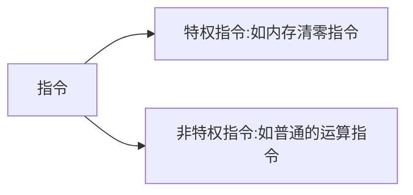
```mermaid
graph LR;
指令 --> 特权指令:如内存清零指令;
指令 --> 非特权指令:如普通的运算指令
```


**特殊指令**：不允许用户程序使用  

用**程序状态字寄存器**（PSW） 中的某标志位来标识当前处理器处于什么状态。 如 0 为用户态， 1 为核心态  

**用户态**：此时CPU只能执行非特权指令  

**核心态**：特权指令、 非特权指令都可执行  

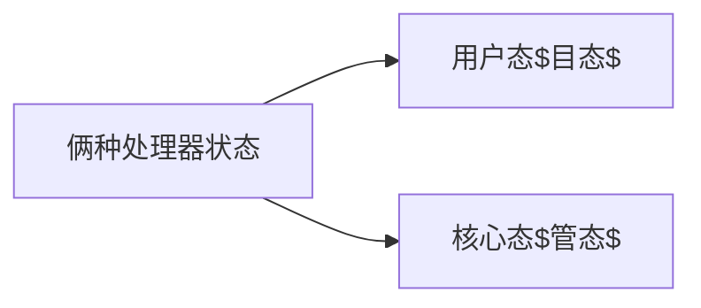
```mermaid
graph LR;
俩种处理器状态 --> 用户态$目态$
俩种处理器状态 --> 核心态$管态$
```


**内核程序**：操作系统的内核程序是系统的管理者，既可以执行**特权指令**， 也可以执行**非特权指令**， 运行在**核心态**。

**应用程序**：为了保证系统能安全运行， 普通应用程序只能执行**非特权指令**， 运行在**用户态**    

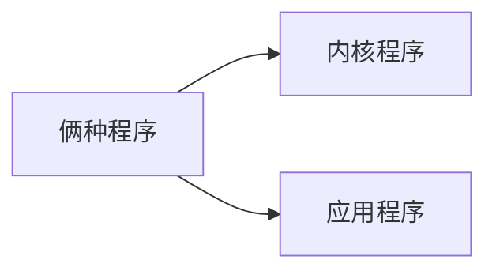
```mermaid
graph LR;
俩种程序 --> 内核程序
俩种程序 --> 应用程序
```


## 操作系统的内核

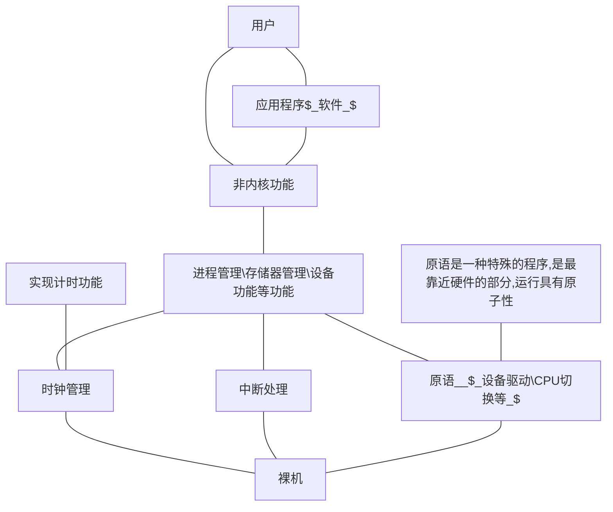
```mermaid
graph TB;
用户 --- 应用程序$_软件_$
用户 --- 非内核功能
应用程序$_软件_$ --- 非内核功能
非内核功能 --- 进程管理\存储器管理\设备功能等功能
进程管理\存储器管理\设备功能等功能 --- 时钟管理
进程管理\存储器管理\设备功能等功能 --- 中断处理
进程管理\存储器管理\设备功能等功能 --- 原语__$_设备驱动\CPU切换等_$

时钟管理 --- 裸机
实现计时功能 --- 时钟管理
中断处理 --- 裸机
原语__$_设备驱动\CPU切换等_$ --- 裸机
原语是一种特殊的程序,是最靠近硬件的部分,运行具有原子性 --- 原语__$_设备驱动\CPU切换等_$
```


**内核**是计算机上配置的底层软件， 是操作系统最基本、 最核心的部分。

实现操作系统内核功能的那些程序就是**内核程序**。 

有的操作系统不把这部分功能归为“ 内核功能 ” 。 也就是说， 不同的操作系统， 对内核功能的划分可能并不一样   

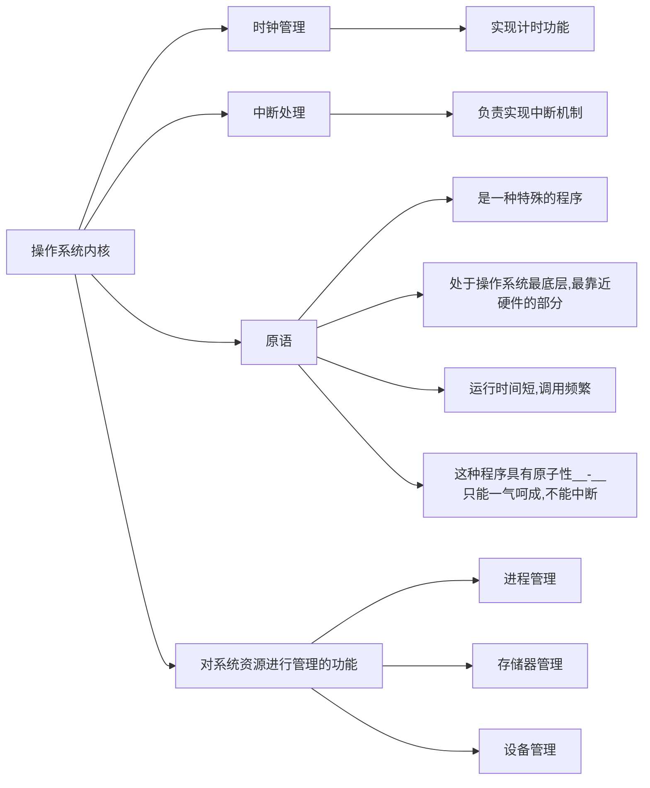
```mermaid
graph LR;
操作系统内核 --> 时钟管理 --> 实现计时功能;

操作系统内核 --> 中断处理 --> 负责实现中断机制;

操作系统内核 --> 原语;
原语 --> 是一种特殊的程序
原语 --> 处于操作系统最底层,最靠近硬件的部分
原语 --> 运行时间短,调用频繁
原语 --> 这种程序具有原子性__-__只能一气呵成,不能中断

操作系统内核 --> 对系统资源进行管理的功能;
对系统资源进行管理的功能 --> 进程管理
对系统资源进行管理的功能 --> 存储器管理
对系统资源进行管理的功能 --> 设备管理

```


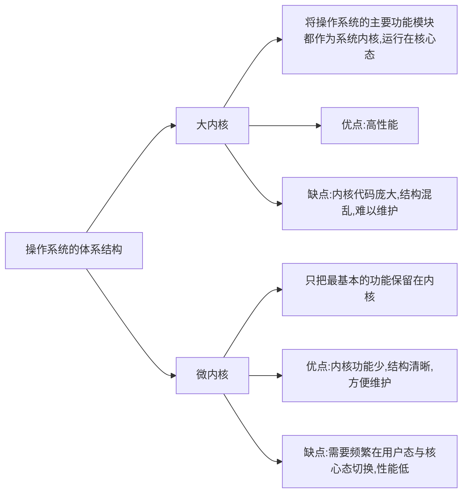
```mermaid
graph LR;
操作系统的体系结构 --> 大内核
大内核 --> 将操作系统的主要功能模块都作为系统内核,运行在核心态
大内核 --> 优点:高性能
大内核 --> 缺点:内核代码庞大,结构混乱,难以维护

操作系统的体系结构 --> 微内核
微内核 --> 只把最基本的功能保留在内核
微内核 --> 优点:内核功能少,结构清晰,方便维护
微内核 --> 缺点:需要频繁在用户态与核心态切换,性能低
```

比喻：

**内核**就是企业的管理层， 负责一些重要的工作。 

只有管理层才能执行**特权指令**， 普通员工只能执行**非特权指令**。 **用户态**、 **核心态**之间的切换相当于普通员工和管理层之间的工作交接

**大内核**： 企业初创时体量不大， 管理层的人会负责大部分的事情。 优点是效率高； 缺点是组织
结构混乱， 难以维护。

**微内核**： 随着企业体量越来越大， 管理层只负责最核心的一些工作。 优点是组织结构清晰， 方
便维护； 缺点是效率低。  


**特权指令**只能在**核心态**下执行

**内核程序**只能在**核心态**下执行

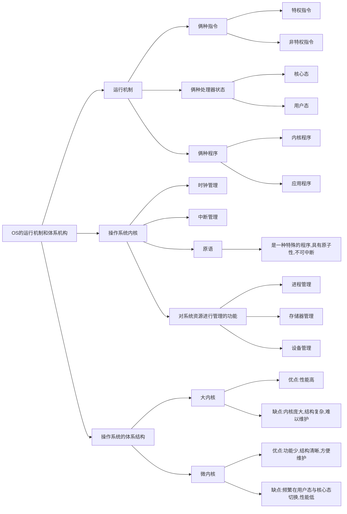
```mermaid
graph LR;
OS的运行机制和体系机构 --> 运行机制
运行机制 --> 俩种指令
俩种指令 --> 特权指令
俩种指令 --> 非特权指令

运行机制 --> 俩种处理器状态
俩种处理器状态 --> 核心态
俩种处理器状态 --> 用户态

运行机制 --> 俩种程序
俩种程序 --> 内核程序
俩种程序 --> 应用程序

OS的运行机制和体系机构 --> 操作系统内核
操作系统内核 --> 时钟管理
操作系统内核 --> 中断管理
操作系统内核 --> 原语 --> 是一种特殊的程序,具有原子性,不可中断
操作系统内核 --> 对系统资源进行管理的功能
对系统资源进行管理的功能 --> 进程管理
对系统资源进行管理的功能 --> 存储器管理
对系统资源进行管理的功能 --> 设备管理

OS的运行机制和体系机构 --> 操作系统的体系结构
操作系统的体系结构 --> 大内核
大内核 --> 优点:性能高
大内核 --> 缺点:内核庞大,结构复杂,难以维护

操作系统的体系结构 --> 微内核
微内核 --> 优点:功能少,结构清晰,方便维护
微内核 --> 缺点:频繁在用户态与核心态切换,性能低

```


-----------------------------------

# 操作系统的体系结构


```mermaid
graph LR;
操作系统的体系结构 --> 大内核/单内核/宏内核
操作系统的体系结构 --> 微内核
```


## 操作系统的内核

操作系统**内核**需要运行在**内核态**

操作系统的**非内核**功能运行在**用户态**  

计算机系统的层次结构

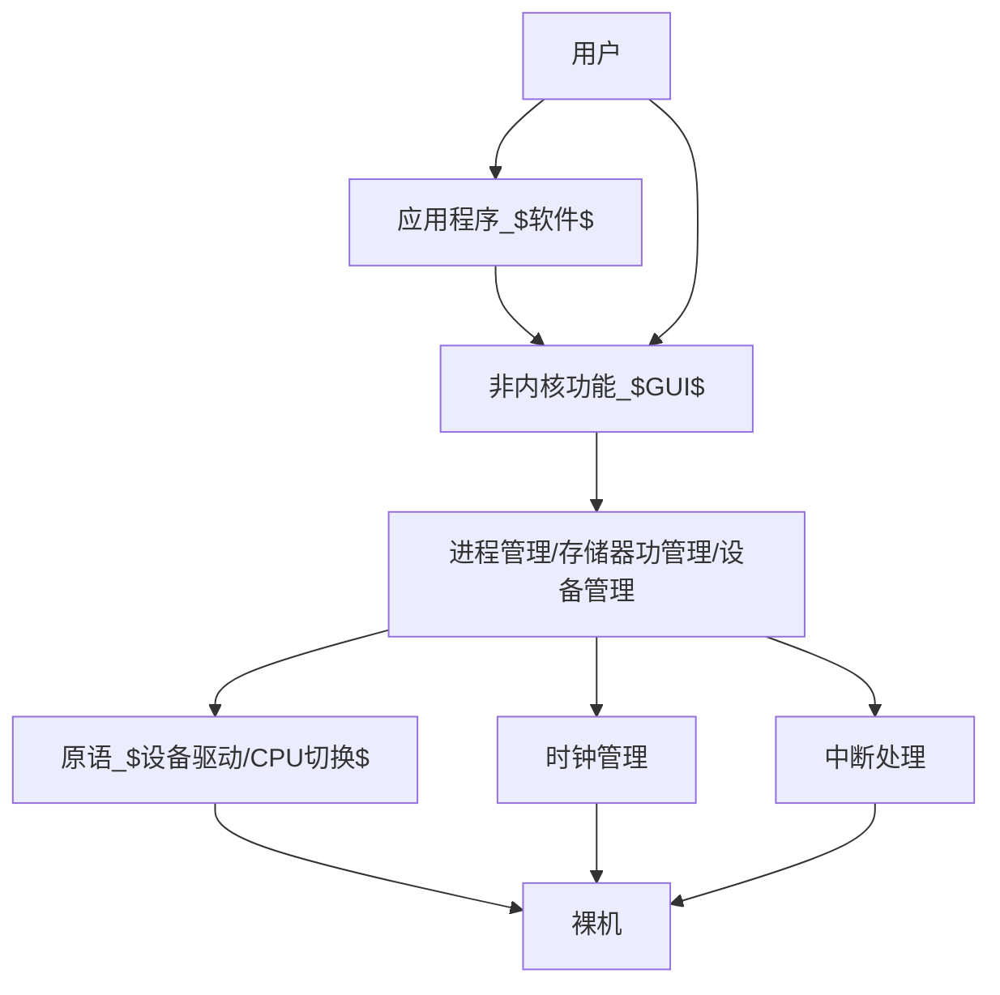
```mermaid
graph TB;
用户 --> 应用程序_$软件$ --> 非内核功能_$GUI$ --> 进程管理/存储器功管理/设备管理 --> 原语_$设备驱动/CPU切换$ --> 裸机
用户 --> 非内核功能_$GUI$
进程管理/存储器功管理/设备管理 --> 时钟管理
进程管理/存储器功管理/设备管理 --> 中断处理
时钟管理 --> 裸机
中断处理 --> 裸机
```


**内核**是操作系统最基本、 最核心的部分。

实现操作系统内核功能的那些程序就是内核程序  

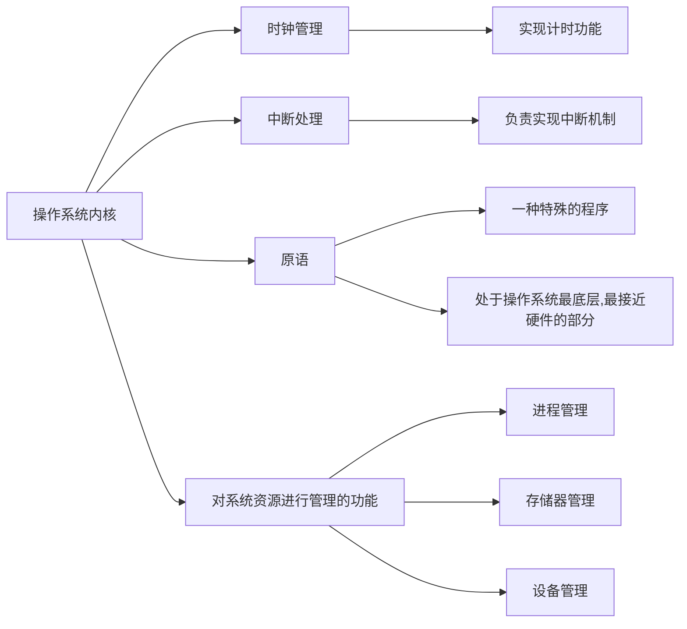
```mermaid
graph LR;
操作系统内核 --> 时钟管理 --> 实现计时功能
操作系统内核 --> 中断处理 --> 负责实现中断机制
操作系统内核 --> 原语 --> 一种特殊的程序
 原语 --> 处于操作系统最底层,最接近硬件的部分
操作系统内核 --> 对系统资源进行管理的功能 --> 进程管理
对系统资源进行管理的功能 --> 存储器管理
 对系统资源进行管理的功能 --> 设备管理
```

## 操作系统的体系结构  


应用程序想要请求操作系统的服务， 这个服务的处理同时涉及到进程管理、 存储管理、 设备管理

变态的过程是有成本的， 要消耗不少时间， 频繁地变态会降低系统性能  

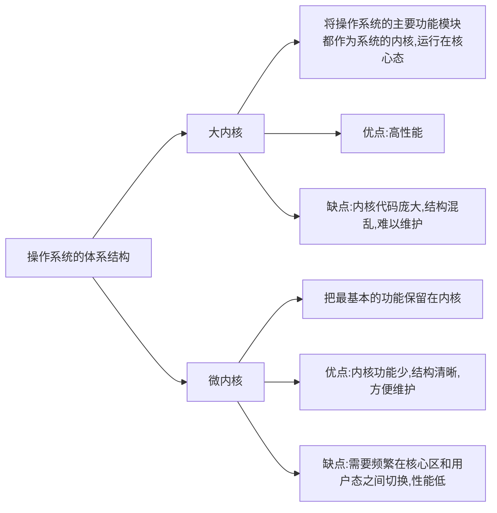
```mermaid
graph LR;
操作系统的体系结构 --> 大内核 --> 将操作系统的主要功能模块都作为系统的内核,运行在核心态
 大内核 --> 优点:高性能
  大内核 --> 缺点:内核代码庞大,结构混乱,难以维护
操作系统的体系结构 --> 微内核 --> 把最基本的功能保留在内核
 微内核 --> 优点:内核功能少,结构清晰,方便维护
  微内核 --> 缺点:需要频繁在核心区和用户态之间切换,性能低
```


-----------------------------

# 系统调用


```mermaid
graph LR;
系统调用 --> 向应用程序提供接口
```

## 系统调用

**操作系统**作为用户和计算机硬件之间的接口， 需要向上提供一些简单易用的服务。 主要包括**命令接口**和**程序接口**。 其中， 程序接口由一组系统调用组成  


“ **系统调用** ” 是操作系统提供给应用程序（程序员/编程人员） 使用的接口， 可以理解为一种可供应用程序调用的特殊函数， 应用程序可以通过系统调用来请求获得操作系统内核的服务  

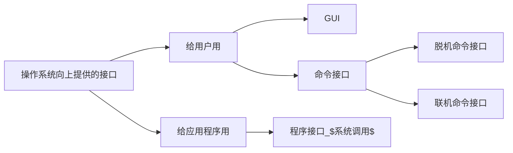
```mermaid
graph LR;
操作系统向上提供的接口 --> 给用户用
给用户用 --> GUI
给用户用 --> 命令接口
命令接口 --> 脱机命令接口
命令接口 --> 联机命令接口

操作系统向上提供的接口 --> 给应用程序用
给应用程序用 --> 程序接口_$系统调用$
```


## 库和系统调用区别

**不涉及**系统调用的库函数： 如：“ 取绝对值 ” 的函数

**涉及**系统调用的库函数： 如 “ 创建一个新文件 ” 的函数  

由**操作系统内核**对**共享资源**进行统一的管理， 并向上提供“ **系统调用** ” ， 用户进程想要那种共享资源， 只能通过系统调用向操作系统内核发出请求。 **内核**会对各个请求进行协调处理  

| 普通应用程序 | 可直接进行系统调用，也可使用库函数，有的库函数涉及系统调用，有的不涉及 |
| ------------ | ------------------------------------------------------------ |
| 编程语言     | 向上提供库函数，有时将系统调用封装成库函数，以隐藏系统调用的一些细节，使程序编程更方便 |
| 操作系统     | 向上提供系统调用，使的上层程序能请求内核的任务               |
| 裸机         |                                                              |

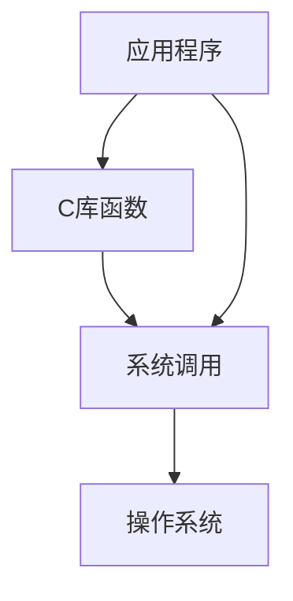
```mermaid
graph TB;
应用程序 --> C库函数 --> 系统调用 --> 操作系统
应用程序 --> 系统调用
```


应用程序通过**系统调用**请求操作系统的服务。 而系统中的各种**共享资源**都由操作系统内核统一掌管， 因此凡是与共享资源有关的操作（如**存储分配**、 **I/O操作**、 **文件管理**等） ， 都必须通过系统调用的方式向操作系统内核提出服务请求， 由操作系统内核代为完成。 这样可以保证系统的**稳定性**和**安全性**， 防止用户进行非法操作  

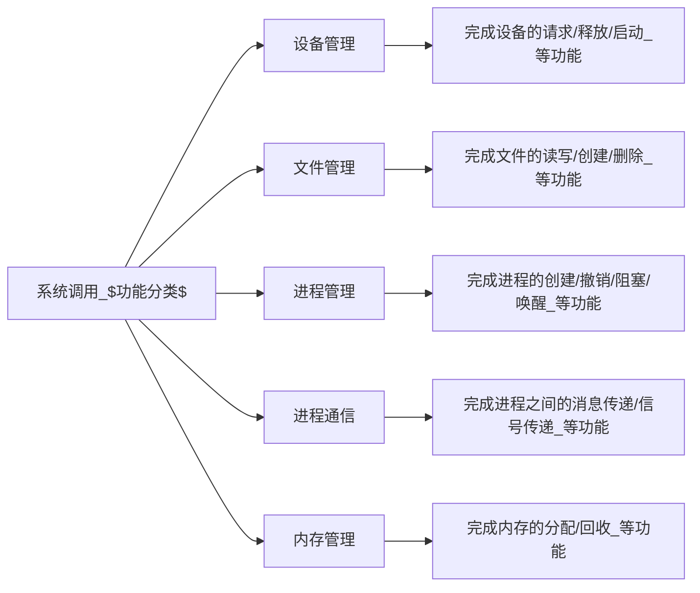
```mermaid
graph LR;
系统调用_$功能分类$ --> 设备管理 --> 完成设备的请求/释放/启动_等功能
系统调用_$功能分类$ --> 文件管理 --> 完成文件的读写/创建/删除_等功能
系统调用_$功能分类$ --> 进程管理 --> 完成进程的创建/撤销/阻塞/唤醒_等功能
系统调用_$功能分类$ --> 进程通信 --> 完成进程之间的消息传递/信号传递_等功能
系统调用_$功能分类$ --> 内存管理 --> 完成内存的分配/回收_等功能
```


## 系统调用的过程

该中断由**陷入指令**引发， 因此转入相应的中断处理程序——即 **系统调用的入口**程序  

传递系统调用参数 -> 执行陷入指令（**用户态**） -> 执行相应的内请求核程序处理系统调用（**核心态**）->  返回应用程序  

1.  陷入指令是在**用户态**执行的， 执行陷入指令之后立即引发一个**内中断**， 使CPU进入核心态

2.  发出系统调用请求是在**用户态**， 而对系统调用的相应处理在**核心态**下进行  

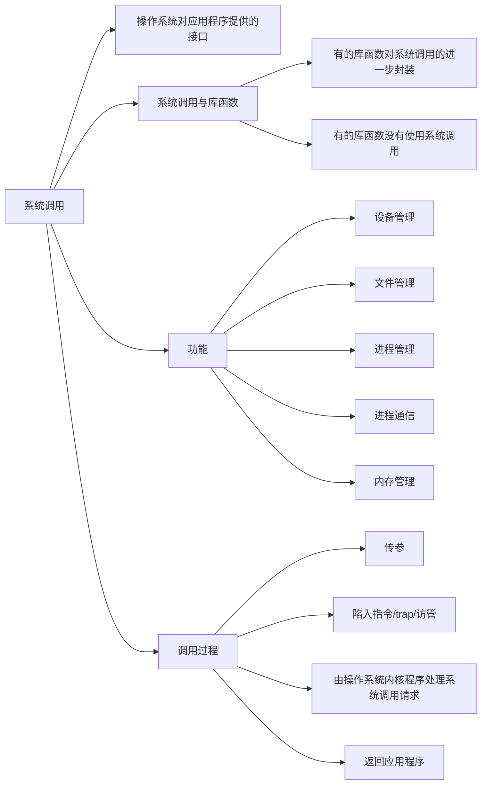
```mermaid
graph LR;
系统调用 --> 操作系统对应用程序提供的接口
系统调用 --> 系统调用与库函数 --> 有的库函数对系统调用的进一步封装
系统调用与库函数 --> 有的库函数没有使用系统调用
系统调用 --> 功能	--> 设备管理
功能	--> 文件管理
功能	--> 进程管理
功能	--> 进程通信
功能	--> 内存管理

系统调用 --> 调用过程
调用过程 --> 传参
调用过程 --> 陷入指令/trap/访管
调用过程 --> 由操作系统内核程序处理系统调用请求
调用过程 --> 返回应用程序
```

----------------------------

# 中断和异常

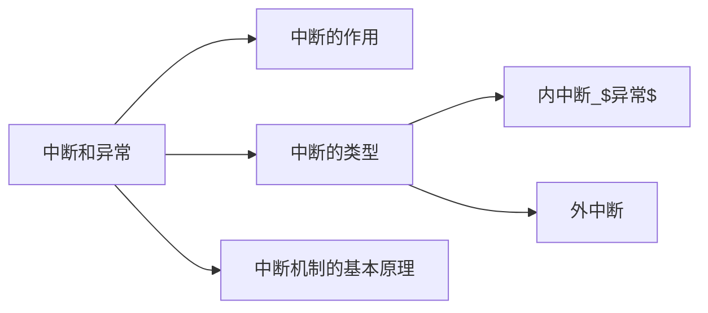
```mermaid
graph LR;
中断和异常 --> 中断的作用

中断和异常 --> 中断的类型
中断的类型 --> 内中断_$异常$
中断的类型 --> 外中断

中断和异常 --> 中断机制的基本原理
```


## 中断的作用

“ **中断** ” 会使CPU由**用户态**变为**内核态**， 使操作系统重新夺回对CPU的控制权  

CPU 上会运行两种程序， 一种是操作系统**内核程序**( 整个系统的管理者 )， 一种是**应用程序**  

在合适的情况下， 操作系统内核会把CPU的使用权主动让给应用程序  

“ **中断** ” 是让**操作系统内核夺回CPU使用权的唯一途径**

如 没有“ 中断 ” 机制， 那么一旦应用程序上CPU运行， CPU就会一直运行这个应用程序  

内核态 -> 用户态： 执行一条特权指令——修改PSW的标志位为“ **用户态** ” ， 这个动作意味着操作系统将主动让出CPU使用权

用户态 -> 内核态： 由“ **中断** ” 引发， 硬件自动完成变态过程， 触发中断信号意味着操作系统将强行夺回CPU的使用权  

>   我有俩把钥匙，一把是共享单车的( 用户态 )，一把是法拉利的 ( 内核态 )，我要速度激情，闪电飘逸就肯定要开法拉利，不可能用共享单车遨游天空把，我开着法拉利可以到富人区，也能到贫民区，开着共享单车就只能在贫民区，要是去富人区，会被打断狗腿，所以，要开法拉利去装*呀

##中断的类型


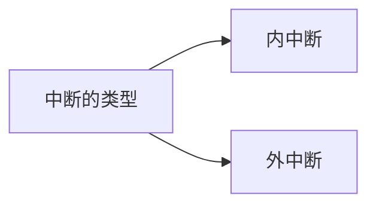
```mermaid
graph LR;
中断的类型 --> 内中断
中断的类型 --> 外中断
```


**内中断**：与当前执行的指令有关，中断信号来源于**CPU内部**  

**外中断**：与当前执行的指令无关，中断信号来源于**CPU外部** 

>   内中断可以看出家里的媳妇要你去干事，你不能抗拒呀，外中断，就是外面的彩旗要你去做事，你也要去处理

###  内中断

与当前执行的指令有关，中断信号来源于CPU内部

若当前执行的指令是非法的， 则会引发一个中断信号 

如：

​	试图在用户态下执行特权指令

​	执行除法指令时发现除数为 0 

有时候应用程序想请求操作系统内核的服务， 此时会执行一条特殊的指令——陷入指令， 该指令会引发一个内部中断信号  

执行“ 陷入指令 ” ， 意味着应用程序主动地将CPU控制权还给操作系统内核。

“ 系统调用 ” ：通过陷入指令完成的  

### 外中断

当前执行的指令无关，中断信号来源于CPU外部  

每一条指令执行结束时， CPU都会例行检查是否有外中断信号 

时钟中断——由时钟部件发来的中断信号  

I/O中断——由输入/输出设备发来的中断信号  


## 中断的分类

```mermaid
graph LR;
中断的分类 --> 内中断_$_异常\例外_$
内中断_$_异常\例外_$ --> 陷入\陷阱_trap
内中断_$_异常\例外_$ --> 故障_fault
内中断_$_异常\例外_$ --> 终止_abort

中断的分类 --> 外中断_中断_$
外中断_中断_$ --> 时钟中断
外中断_中断_$ --> I\O中断请求
```


## 中断机制的基本原理

不同的中断信号， 需要用不同的中断处理程序来处理。 当CPU检测到中断信号后， 会根据中断信号的类型去查询“ **中断向量表** ” ， 以此来找到相应的中断处理程序在内存中的存放位置  

中断处理程序一定是**内核程序**， 需要运行在“ **内核态** ” 

>   外面彩旗太多，当有彩旗找你，你肯定要用微信查一下是几号鱼，要不然找到她，都不知道叫什么，然后你要开着法拉利去，不能用共享单车去撩吧。


```mermaid
graph LR;
中断和异常 --> 中断的作用
中断的作用 --> 让操作系统的内核剥夺CPU的控制权
中断的作用 --> 让CPU从用户态转换为内核态

中断和异常 --> 中断的分类
中断的分类 --> 内中断_异常\例外
内中断_异常\例外 --> 陷入\陷阱_trap
内中断_异常\例外 --> 故障_fault
内中断_异常\例外 --> 终止_abort

中断的分类 --> 外中断_中断
外中断_中断--> 时钟中断
外中断_中断--> I/O中断请求

中断和异常 --> 中断机制的基本实现原理
中断机制的基本实现原理 --> 检查中断信号
检查中断信号 --> 内中断:CPU在执行指令时会检查是否有异常发生
检查中断信号 --> 外中断:每个指令周期末尾,CPU都会检查是否有外中断信号需要处理

中断机制的基本实现原理 --> 找到相应的中断处理程序
找到相应的中断处理程序 --> 通过_中断向量表_实现

```


```mermaid
graph LR;
OS概叙 --> OS的概念和功能 --> 向上提供接口
OS的概念和功能 --> 对下层功能的拓展
OS的概念和功能 --> 对系统资源的管理

OS概叙 --> OS的发展/特征
OS概叙 --> OS的运行机制
OS的运行机制 --> 俩种程序/俩种CPU状态/俩种指令
OS概叙 --> OS体系结构
OS体系结构 --> 大内核/微内核

OS概叙 --> 系统调用
系统调用 --> 作用
系统调用 --> 系统调用过程
系统调用 --> 陷入/trap/访管指令

OS概叙 --> 中断和异常
中断和异常 --> 何作用
中断和异常 --> 区别
中断和异常 --> 处理
```


