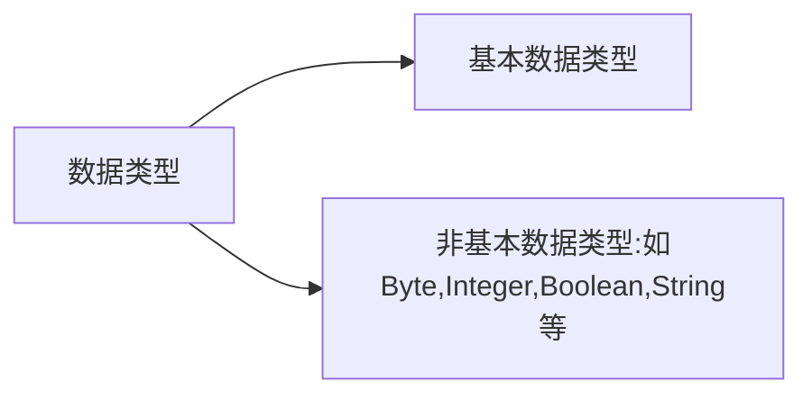

#　算法引论

##　算法与程序

算法: 是满足下述性质的指令序列

*   输 入：有零个或多个外部量作为算法的输入。 

*   输 出：算法产生至少一个量作为输出。 

*   确定性：组成算法的每条指令清晰、无歧义。

*   有限性：算法中每条指令的执行次数有限，执行每条指令的时间也有限。

程序：是算法用某种程序设计语言的具体实现。

​		程序可以不满足算法的性质(4)即有限性。 


##　表达算法的抽象机制

1.  从机器语言到高级语言的抽象

高级程序设计语言的主要好处是：

-   [ ] 高级语言更接近算法语言，易学、易掌握，一般工程技术人员只需  要几周时间的培训就可以胜任程序员的工作；
-   [ ] 高级语言为程序员提供了结构化程序设计的环境和工具，使得设计出来的程序可读性好，可维护性强，可靠性高；
-   [ ] 高级语言不依赖于机器语言，与具体的计算机硬件关系不大，因而所写出来的程序可植性好、重用率高；
-   [ ] 把繁杂琐碎的事务交给编译程序，所以自动化程度高，开发周期短，程序员可以集中时间和精力从事更重要的创造性劳动，提高程序质量。

2.  抽象数据类型

**抽象数据类型**是算法的一个数据模型连同定义在该模型上并作为算法构件的一组运算。 

抽象数据类型带给算法设计的好处有： 

（1）算法顶层设计与底层实现分离；

（2）算法设计与数据结构设计隔开，允许数据结构自由选择；

   (3)   数据模型和该模型上的运算统一在ADT中，便于空间和时间耗费的折衷；

   (4)   用抽象数据类型表述的算法具有很好的可维护性；

（5）算法自然呈现模块化；

（6）为**自顶向下**逐步求精和**模块化**提供有效途径和工具；

（7）算法结构清晰，层次分明，便于算法正确性的证明和复杂性的分析。 


## 描述算法

采用Java语言描述算法。

以下，对**Java**语言的若干重要特性作简要概述:  

1.  **Java**程序结构 

（1）**Java**程序的两种类型：应用程序和 **applet**

 区别：应用程序的主方法为`main`，其可在命令行中用命令 语句 **java** 应用程序名 来执行；

 **applet** 的主方法为 `init`，其必须嵌入 **HTML **文件，由 **Web**浏览器 或 **applet** 阅读器来执行。

（2）包：**java **程序 和 类可以包( **packages** )的形式组织管理。 

（3）`import`语句：在 **java** 程序中可用 **import** 语句加载所需的包。

 例如，`import java.io.*;` 语句加载 **java.io** 包。  

2.  **Java**数据类型



**Java**对两种数据类型的不同处理方式： 

对基本数据类型：在声明一个具有基本数据类型的变量时，自动建立该数据类型的对象（或称实例）。如: `int k;`

对非基本数据类型：语句 **String s** ; 并不建立具有数据类型 **String**的对象，而是建立一个类型 **String** 的引用对象， 数据类型为**String **的对象可用下面的`new`语句建立。 

```java
s = new  String(“Welcome”);
String s = new  String(“Welcome”);
```


**Java**基本数据类型

| 类型    | 缺省值 | 分配空间（bits） | 取值范围                         |
| ------- | ------ | ---------------- | -------------------------------- |
| boolean | false  | 1                | [true,false]                     |
| byte    | 0      | 8                | [-128,127]                       |
| char    | \u0000 | 16               | [\u0000,\uFFFF]                  |
| double  | 0.0    | 64               | ±4.9 * 10^ -324 ~ ±1.8 * 10^ 308 |
| float   | 0.0    | 32               | ±1.4*10-45 ~ ±3.4*1038           |
| int     | 0      | 32               | [-2147483648, 2147483647]        |
| long    | 0      | 64               | ±9.2*10^ 17                      |
| short   | 0      | 16               | [-32768, 32767]                  |

3.  方法

在**Java**中，执行特定任务的函数 或 过程 统称为 方法(**methods**) 。例如，**java**的**Math**类给出的 常见数学计算的方法 如下表所示：

| **方法** | **功能**          | **方法** | **功能**     |
| -------- | ----------------- | -------- | ------------ |
| abs(x)   | x的绝对值         | max(x,y) | x和y中较大者 |
| ceil(x)  | 不小于x的最小整数 | min(x,y) | x和y中较小者 |
| cos(x)   | x的余弦           | pow(x,y) | xy           |
| exp(x)   | ex                | sin(x)   | x的正弦      |
| floor(x) | 不大于x的最大整数 | sqrt(x)  | x的平方根    |
| log(x)   | x的自然对数       | tan(x)   | x的正切      |


计算表达式 **( a + b + |a - b| ) / 2** 值的自定义方法ab描述如下： 

```java
public static int ab(int a, int b)
{
	return (a + b + Math.abs(a - b) ) / 2;
} 
```

（1）方法参数：**Java**中所有方法的参数均为值参数。上述方法ab中，a和b 是形式参数，在调用方法时通过实际参数赋值。 

（2）方法重载：**Java**允许**方法重载**，即允许定义有不同签名的同名方法。

 上述方法ab可重载为： 

```java
public static double ab(double a, double b)
{
	return (a + b + Math.abs(a - b)) / 2.0;
} 
```

4.  异常

**Java**的异常提供了一种处理错误的方法。当程序发现一个错误，就引发一个异常，以便在合适地方捕获异常并进行处理。

  通常用 **try **块来定义异常处理。每个异常处理由一个 **catch** 语句组成。

```java
public static void main(String [] args)
{
      try 
      {
          f ( ); 
      }
      catch (exception1)
      { 
          //异常处理; 
      }
      catch (exception2)
      { 
          //异常处理; 
      }
      //…
      finally
      { 
          //finally块; 
      }
} 
```

5.  **Java**的类

**Java**的类一般由4个部分组成:

(1)**类名**

(2)**数据成员**

(3)**方法**

(4)**访问修饰**: 公有(public),  私有(private),  保护(protected)

6.  通用方法

下面的方法**swap**用于交换一维整型数组a的位置i和位置j处的值。 

```java
//只适用于整型数组
public static void swap(int [] a, int i, int j)
{
	int temp = a[i];
	a[i] = a[j];
	a[j] = temp;
} 
```

```java
//具有通用性，适用于Object类型及其所有子类 
public static void swap(object [] a, int i, int j)
{
	object temp = a[i];
	a[i] = a[j];
	a[j] = temp;
} 
```

（1）**Computable**界面

```java
//sum通用化
public static Computable sum(Computable [] a, int n)
{
      if (a.length == 0) 
      {
          return null;
      }
      Computable sum = (Computable) a[0].zero();
    
      for (int i = 0; i < n; i++)
      {
         sum.increment(a[i]);
      }

      return sum;
}
```

（2）**java.lang.Comparable** 界面

  **Java**的 **Comparable** 界面中惟一的方法头**compareTo**用于比较2个元素的大小。

例如 `java.lang.Comparable.x.compareTo(y)` 返回 x-y 的符号，当 x<y 时返回负数，当 x=y 时返回0，当 x>y 时返回正数。

（3）**Operable**界面

  有些通用方法同时需要 **Computable **界面 和 **Comparable** 界面的支持。为此可定义Operable界面如下:

```java
public interface Operable extends Computable, Comparable
{
    
} 
```

（4）自定义包装类

由于**Java**的包装类 如 **Integer **等 已定义为`final`型，因此无法定义其子类，作进一步扩充。为了需要可自定义包装类。

7.  垃圾收集

**Java**的`new`运算用于分配所需的内存空间。

例如， `int [] a = new int[500000];` 分配2000000字节空间给整型数组a。频繁用`new`分配空间可能会耗尽内存。

**Java**的垃圾收集器会适时扫描内存，回收不用的空间（垃圾）给`new`重新分配。 

8.  递归

Java允许方法调用其自身。这类方法称为递归方法

```java
//计算一维整型数组前n个元素之和的递归方法
public static int sum(int [] a, int n)
{
      if (n == 0) 
      {
          return 0;
      }
      else 
      {
          return a[n-1] + sum(a, n-1);
      }
} 
```


## 算法复杂性分析

算法复杂性是算法运行所需要的计算机资源的量，需要时间资源的量称为**时间复杂性**，需要的空间资源的量称为**空间复杂性**。

这个量应该只依赖于算法要解的问题的规模、算法的输入和算法本身的函数。如果分别用 N、I 和 A 表示算法要解问题的规模、算法的输入和算法本身，而且用 C 表示复杂性，那么，应该有 C = F(N, I, A) 。

一般把 **时间复杂性** 和 **空间复杂性** 分开，并分别用 T 和 S 来表示，则有： T = T(N, I) 和 S = S(N, I) 。（通常，让A隐含在复杂性函数名当中） 

最坏情况下的时间复杂性：


最好情况下的时间复杂性：


平均情况下的时间复杂性：


其中DN是规模为 N 的合法输入的集合；I*是DN中使 T(N, I * ) 达到 Tmax(N) 的合法输入； I' 是中使 T(N, I' ) 达到 Tmin(N) 的合法输入；而 P(I) 是在算法的应用中出现输入 I 的概率。

算法复杂性在渐近意义下的阶：

渐近意义下的记号：O、Ω、θ、o 

设 f(N) 和 g(N) 是定义在正数集上的正函数

**O**的定义：如果存在正的 常数C 和 自然数N0，使得当N >= N0时有 f(N) <= Cg(N)，则称函数 f(N) 当 N 充分大时上有界，且 g(N) 是它的一个上界，记为 f(N) = O(g(N)) 。即f(N)的阶不高于g(N)的阶。 

根据O的定义，容易证明它有如下运算规则：

  (1) O(f) + O(g) = O(max(f, g))；

  (2) O(f) + O(g) = O(f + g)；

  (3) O(f)O(g) = O(fg)；

  (4) 如果g(N) = O(f(N))，则O(f) + O(g) = O(f)；

  (5) O(Cf(N)) = O(f(N))，其中C是一个正的常数；

  (6) f = O(f)。 

  **Ω**的定义：如果存在正的 常数C 和 自然数N0，使得当N >= N0时有f(N) >= Cg(N)，则称函数f(N)当N充分大时下有界，且g(N)是它的一个下界，记为f(N) = Ω(g(N))。即f(N)的阶不低于g(N)的阶。 

  **θ**的定义：定义f(N) = θ(g(N))当且仅当f(N) = O(g(N))且 f(N) = Ω(g(N))。此时称f(N)与g(N)同阶。

  **o**的定义：对于任意给定的ε＞0，都存在正整数N0，使得当N >= N0时有f(N)/Cg(N) <= ε,则称函数f(N),  当N充分大时的阶比g(N)低，记为f(N) = o(g(N))。  例如，4NlogN + 7=o(3N^2 + 4NlogN + 7)。 

